# Architecture Overview — Clinical Randomization Generator

> **Version:** v1.1.0  
> **Stack:** Angular 21 · NgRx Signals · Web Workers · Vitest · Playwright · Tailwind CSS

---

## Table of Contents

1. [What the Application Does](#1-what-the-application-does)
2. [Repository Layout](#2-repository-layout)
3. [Domain-Driven Design Structure](#3-domain-driven-design-structure)
4. [Application Bootstrap & Routing](#4-application-bootstrap--routing)
5. [Component Tree](#5-component-tree)
6. [Randomization Engine](#6-randomization-engine)
7. [Web Worker Communication](#7-web-worker-communication)
8. [State Management — NgRx SignalStore](#8-state-management--ngrx-signalstore)
9. [Full Data-Flow: Form → Results](#9-full-data-flow-form--results)
10. [Data Model](#10-data-model)
11. [Code Generation Service](#11-code-generation-service)
    - [11.1 Why code generation exists](#111-why-code-generation-exists)
    - [11.2 Seed translation — hashCode](#112-seed-translation--hashcodeseed)
    - [11.3 Overall pipeline](#113-overall-pipeline)
    - [11.4 Generated script structure](#114-generated-script-structure--section-by-section)
    - [11.5 R script](#115-r-script-generater)
    - [11.6 Python script](#116-python-script-generatepython)
    - [11.7 SAS script](#117-sas-script-generatesass)
    - [11.8 PRNG comparison](#118-prng-comparison)
12. [ESLint Architectural Boundaries](#12-eslint-architectural-boundaries)
13. [Testing Strategy](#13-testing-strategy)
14. [Build, Tooling & Versioning](#14-build-tooling--versioning)

---

## 1. What the Application Does

The Clinical Randomization Generator is a browser-only Angular SPA that produces
**statistically sound, reproducible, stratified-block randomization schemas** for
clinical trials. A researcher fills in a configuration form (treatment arms, strata,
sites, block sizes, subject-ID mask, optional seed) and the tool:

1. Runs a seeded **Fisher-Yates shuffle** algorithm inside a **Web Worker** to keep
   the UI fully responsive.
2. Displays the resulting schema in a paginated, blindable results grid.
3. Exports the schema to **CSV** or **PDF**.
4. Generates equivalent **R / SAS / Python** scripts so the trial statistician can
   reproduce the exact allocation on a validated, 21 CFR Part 11-capable system.

> **Compliance notice:** The in-browser schema is marked *DRAFT*. For regulated
> studies, only the exported code scripts should be used in production.

---

## 2. Repository Layout

```
clinical-randomization-generator/
├── docs/
│   └── ARCHITECTURE.md          ← you are here
│
├── src/
│   ├── main.ts                  Bootstrap: bootstrapApplication(App, appConfig)
│   ├── index.html               Single HTML entry point
│   ├── styles.css               Tailwind base + Google Material Icons import
│   ├── setup-vitest.ts          Vitest global setup (Angular TestBed init)
│   │
│   ├── environments/
│   │   └── version.ts           Auto-generated: export const APP_VERSION
│   │
│   └── app/
│       ├── app.ts               Root component (header nav + <router-outlet>)
│       ├── app.config.ts        ApplicationConfig: router, HttpClient
│       ├── app.routes.ts        Route table → 3 routes
│       ├── app.spec.ts          Smoke test: App component renders
│       │
│       ├── features/            Thin, non-domain page components
│       │   ├── landing/
│       │   │   └── landing.component.ts   Hero page with "Get Started" CTA
│       │   └── about/
│       │       └── about.component.ts     Feature overview + 21 CFR notice
│       │
│       └── domain/              All business logic — Domain-Driven Design
│           │
│           ├── core/
│           │   └── models/
│           │       └── randomization.model.ts   Shared interfaces (single source of truth)
│           │
│           ├── randomization-engine/        Bounded context 1
│           │   ├── core/
│           │   │   ├── randomization-algorithm.ts          Pure PRNG function
│           │   │   ├── randomization-algorithm.spec.ts     Unit tests
│           │   │   └── randomization-algorithm-parity.spec.ts  Golden-master parity tests
│           │   ├── worker/
│           │   │   ├── randomization-engine.worker.ts      Web Worker entry point
│           │   │   └── worker-protocol.ts                  Typed message interfaces
│           │   ├── randomization.service.ts                SSR/fallback Observable wrapper
│           │   ├── randomization.service.spec.ts
│           │   ├── randomization-engine.facade.ts          Single UI entry point
│           │   └── randomization-engine.facade.spec.ts
│           │
│           ├── study-builder/               Bounded context 2
│           │   ├── store/
│           │   │   ├── study-builder.store.ts              NgRx SignalStore
│           │   │   └── study-builder.store.spec.ts
│           │   └── components/
│           │       ├── generator.component.ts              Page shell + layout
│           │       ├── generator.component.spec.ts
│           │       ├── config-form.component.ts            Reactive form + presets
│           │       ├── config-form.component.html
│           │       └── config-form.component.spec.ts
│           │
│           └── schema-management/           Bounded context 3
│               ├── services/
│               │   ├── code-generator.service.ts           R / SAS / Python emitters
│               │   └── code-generator.service.spec.ts
│               └── components/
│                   ├── results-grid.component.ts           Paginated results + exports
│                   ├── results-grid.component.html
│                   ├── results-grid.component.spec.ts
│                   ├── code-generator-modal.component.ts   Language-tab modal
│                   ├── code-generator-modal.component.html
│                   └── code-generator-modal.component.spec.ts
│
├── tests_e2e/                   Playwright end-to-end tests
│   ├── navigation.spec.ts
│   ├── form-validation.spec.ts
│   ├── schema-generation.spec.ts
│   ├── results-operations.spec.ts
│   └── code-generator.spec.ts
│
├── generate-version.js          Pre-build script: writes src/environments/version.ts
├── angular.json                 Angular CLI workspace config
├── eslint.config.js             ESLint + angular-eslint + boundary rules
├── playwright.config.ts         Playwright project config
├── tsconfig.json                TypeScript base config
├── vitest.config.ts             Vitest config (jsdom environment)
├── .releaserc.json              semantic-release config
└── package.json
```

---

## 3. Domain-Driven Design Structure

The `src/app/domain/` tree is organised around three bounded contexts that each own their code and have strict import rules enforced by ESLint.

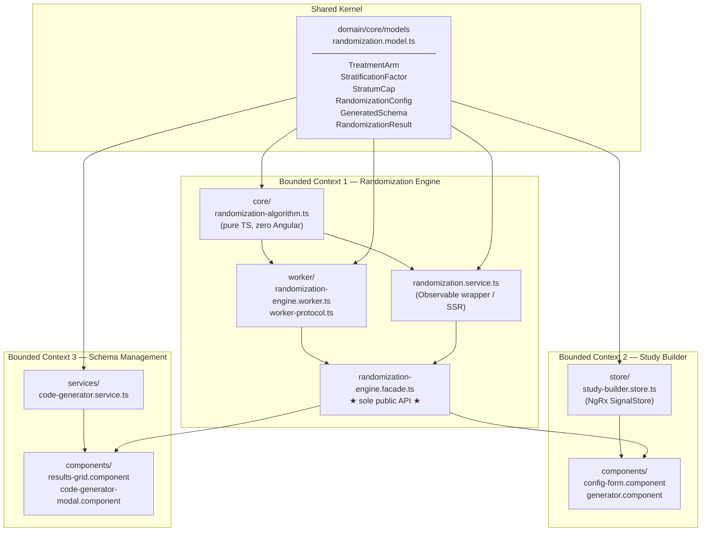

**Dependency rules (enforced by ESLint `no-restricted-imports`):**

| Consumer | Allowed | Forbidden |
|---|---|---|
| `study-builder/**` | `RandomizationEngineFacade`, `domain/core/models` | `randomization.service`, `core/**` (algorithm), `worker/**` |
| `randomization-engine/core/**` | `domain/core/models`, `seedrandom` | Any `@angular/*` package |

---

## 4. Application Bootstrap & Routing

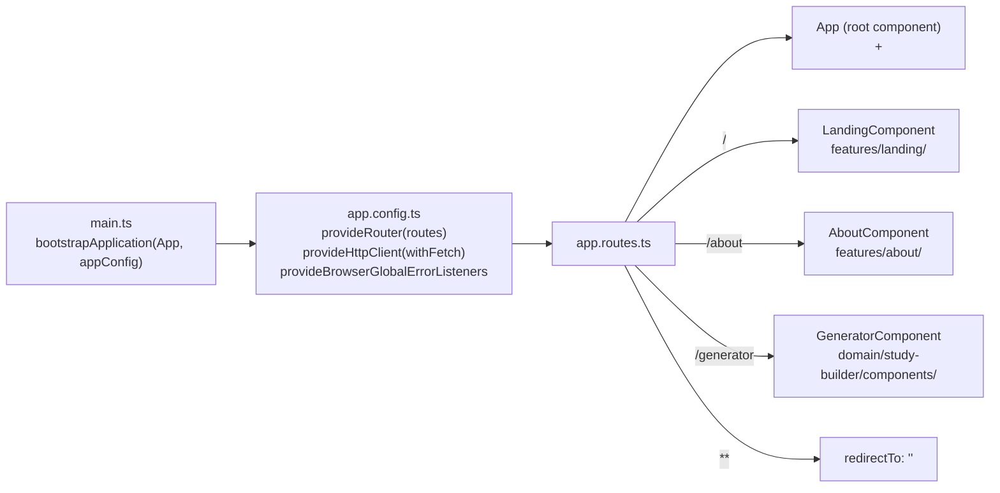

`appConfig` uses the **standalone component API** (no `NgModule`). `HttpClient` is
provided via `withFetch()` for compatibility with the Angular `@angular/ssr` SSR
adapter (the app ships an SSR server in `dist/app/server/server.mjs`).

---

## 5. Component Tree

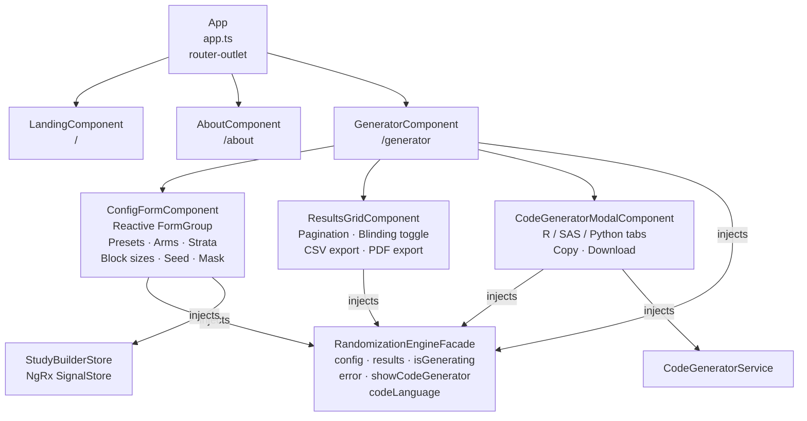

All components are **standalone** (no `NgModule`). `ChangeDetectionStrategy.OnPush`
is used on `GeneratorComponent` and `App`. The `RandomizationEngineFacade` is
`providedIn: 'root'`, making it a singleton shared across all components without
manual provider registration.

---

## 6. Randomization Engine

The randomization engine is split into three layers to satisfy two conflicting
requirements: **(a)** the algorithm must run inside a Web Worker (no Angular), and
**(b)** the rest of the app is Angular.

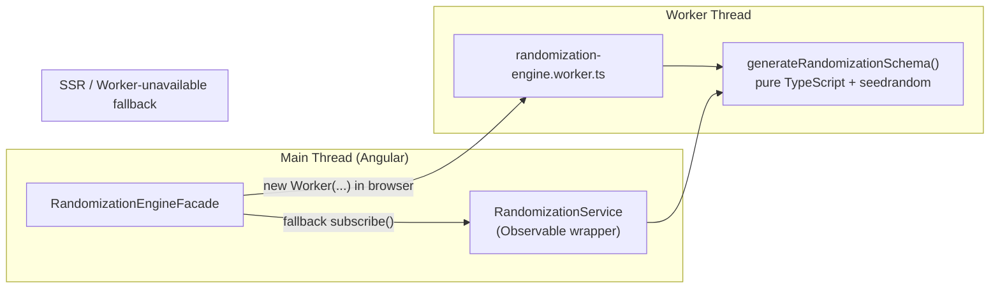

### The Core Algorithm (`randomization-algorithm.ts`)

The single exported function `generateRandomizationSchema(config)`:

1. **Resolves seed** — uses `config.seed` if provided, otherwise generates a random
   string and attaches it to a copy of the config (non-mutating).
2. **Cartesian product** — iterates `config.strata` to build every combination of
   stratum levels (e.g. `{sex: M, age: <65}`, `{sex: M, age: ≥65}`, …).
3. **Validates block sizes** — throws if any block size is not an exact multiple of
   the total arm ratio sum.
4. **Generates blocks** — for each _(site × stratum combo)_ pair, while
   `stratumSubjectCount < cap`, picks a random block size, fills the block with arms
   weighted by ratio, then applies a **Fisher-Yates shuffle** driven by the
   `seedrandom` PRNG.
5. **Formats subject IDs** — replaces `[SiteID]`, `[StratumCode]`, and `[001]`
   (with arbitrary padding) tokens in `subjectIdMask`.
6. Returns a `RandomizationResult` object with `schema[]` rows and `metadata`.

> **Parity guarantee:** The golden-master tests in
> `randomization-algorithm-parity.spec.ts` assert that `generateRandomizationSchema`
> produces the exact same field-by-field output as the decommissioned legacy
> `RandomizationService` for five diverse configurations. Any change to the PRNG
> consumption order will break these tests and must be rejected.

---

## 7. Web Worker Communication

The Facade owns the Worker lifecycle and uses a **promise-map pattern** to correlate
async responses to their originating calls.

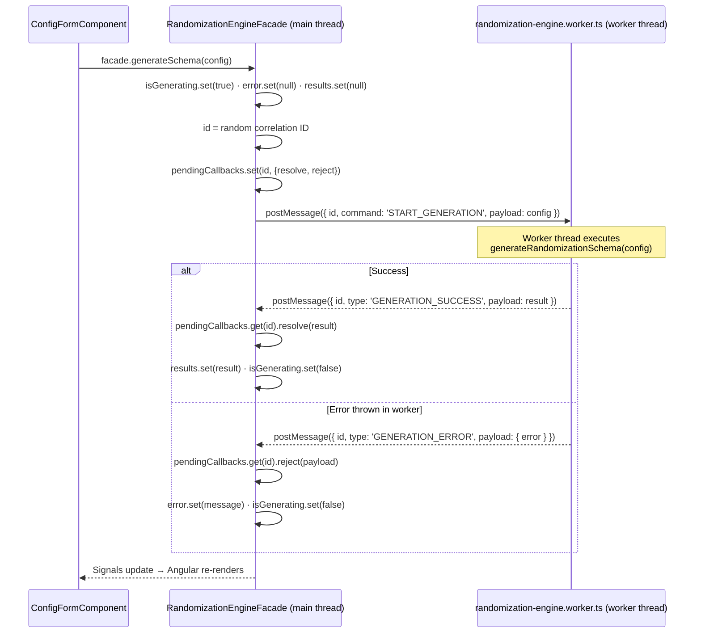

**SSR / Worker-unavailable fallback:** When `PLATFORM_ID` is not `'browser'` (SSR)
or when `new Worker(...)` throws, the Facade calls
`RandomizationService.generateSchema(config).subscribe(...)` synchronously on the
main thread. This keeps the app functional in environments that block worker
construction.

### Worker Protocol Types (`worker-protocol.ts`)

```
WorkerCommand<T>  { id: string; command: WorkerCommandType; payload: T }
WorkerResponse<T> { id: string; type: WorkerResponseType;  payload: T }

GenerationCommand        = WorkerCommand<RandomizationConfig>
GenerationSuccessResponse = WorkerResponse<RandomizationResult>
GenerationErrorResponse   = WorkerResponse<{ error: { error: string } }>
```

---

## 8. State Management — NgRx SignalStore

All mutable state that crosses the boundary between the form and the results grid
lives in two places:

| Store | Location | Responsibility |
|---|---|---|
| `StudyBuilderStore` | `domain/study-builder/store/` | Strata signal → reactive Cartesian combinations; preset definitions; `buildConfig()` helper |
| `RandomizationEngineFacade` | `domain/randomization-engine/` | `config`, `results`, `isGenerating`, `error`, `showCodeGenerator`, `codeLanguage` |

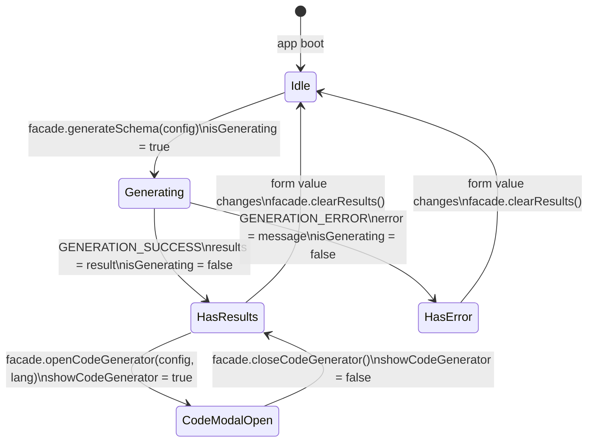

### `StudyBuilderStore` internals

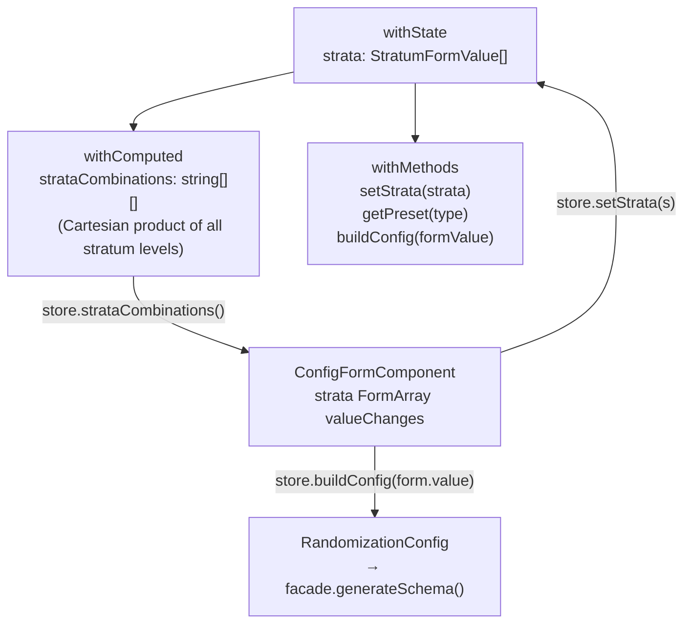

The `strataCombinations` computed signal replaces the imperative
`updateStratumCaps()` call that previously lived inside the component; Angular
re-evaluates it automatically whenever the `strata` signal changes.

---

## 9. Full Data-Flow: Form → Results

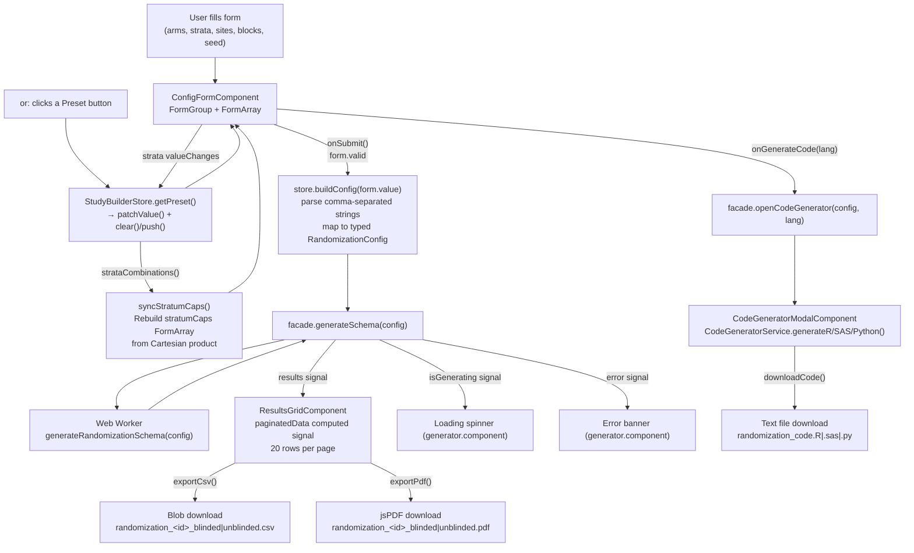

---

## 10. Data Model

All interfaces live in a single file: `domain/core/models/randomization.model.ts`.
This is the **shared kernel** — every other module imports from here; nothing
re-declares these types.

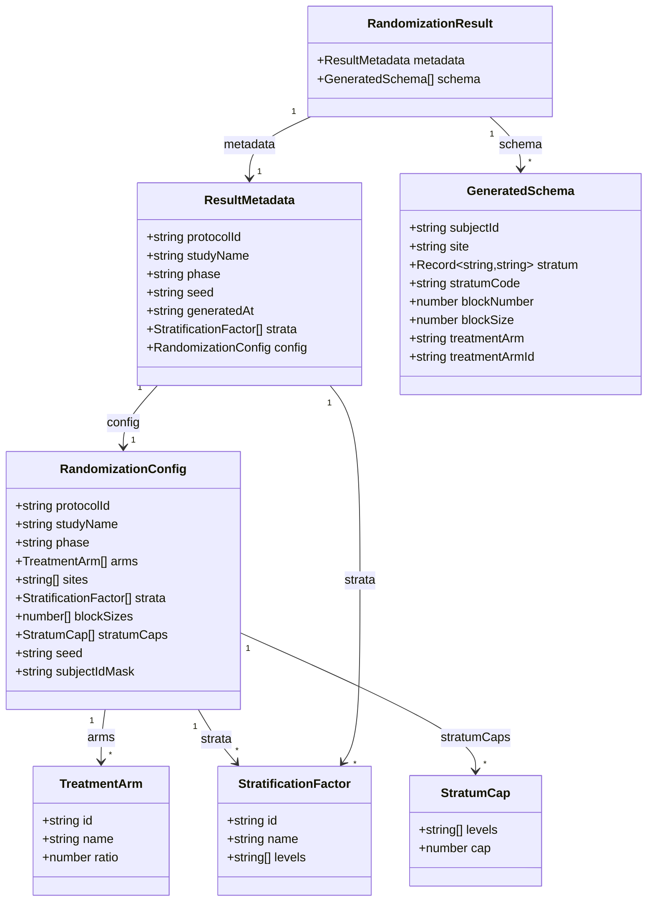

### Subject ID Mask tokens

| Token | Replacement |
|---|---|
| `[SiteID]` | The raw site identifier string |
| `[StratumCode]` | First 3 chars of each stratum level, uppercased, joined with `-` |
| `[001]` | Subject counter padded to 3 digits |
| `[0001]` | Subject counter padded to 4 digits (or any `[0…1]` pattern) |

Example: mask `[SiteID]-[StratumCode]-[001]` → `US01-<65-F-003`

---

## 11. Code Generation Service

`CodeGeneratorService` (`domain/schema-management/services/`) is the only part of
the application that translates a `RandomizationConfig` object into runnable source
code. It is a pure, stateless service: given the same config, it always produces the
same script text.

### 11.1 Why code generation exists

The web app's PRNG is `seedrandom` (the Alea algorithm). R, SAS, and Python each
ship their own incompatible PRNGs (Mersenne-Twister, Mersenne-Twister, PCG64
respectively). A byte-identical reproduction of the web UI schema inside a validated
statistical environment is therefore impossible without shipping the Alea PRNG to
every language — impractical and unsupported.

Instead, the generated scripts embed **all study parameters as literals** and use the
language-native PRNG. The resulting schema is statistically identical in distribution
(same block sizes, same ratios, same caps, same balance properties) but the
subject-by-subject sequence differs. This is the intended workflow:

1. **Design phase** — use the web UI to quickly iterate and validate the study design.
2. **Execution phase** — download and run the generated script inside your
   organisation's validated environment to produce the **official** schema.

The exported script becomes the auditable source of truth for the trial.

### 11.2 Seed translation — `hashCode(seed)`

The web app stores seeds as arbitrary strings (e.g. `"abc123"` or a random
alphanumeric). Statistical software requires a non-negative 32-bit integer for
`set.seed()` / `call streaminit()` / `np.random.default_rng()`.

`hashCode(seed: string): number` converts the string:

```
hash = 0
for each character code c:
    hash = (hash << 5) - hash + c   // djb2-style multiply-add
    hash |= 0                        // coerce to signed 32-bit integer
return (hash >>> 0) % 2_147_483_647  // unsigned right-shift → mod into 31-bit range
```

The `>>> 0` unsigned right-shift avoids the `Math.abs(-2147483648) === 2147483648`
edge case that would exceed the 31-bit limit. The result is always in
`[0, 2_147_483_646]` — safe for all three language seed ranges.

### 11.3 Overall pipeline

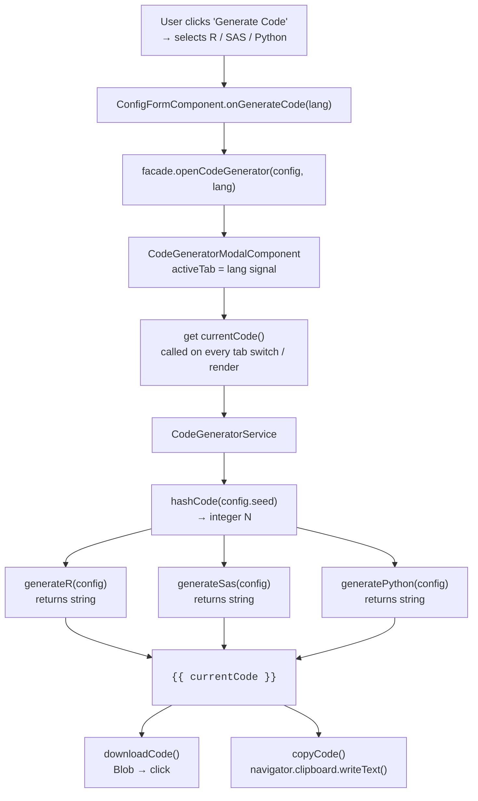

### 11.4 Generated script structure — section by section

Every generated script follows the same logical sections regardless of language:

| Section | Purpose |
|---|---|
| **File header comments** | Protocol ID, study name, app version, ISO timestamp, PRNG name |
| **Seed** | Language-native `set.seed()` / `call streaminit()` / `default_rng()` call |
| **Parameters** | Arms, ratios, sites, block sizes encoded as language literals |
| **Stratum caps map** | Named vector (R), dataset (SAS), or dict (Python) mapping combo key → max subjects |
| **Strata levels** | One variable per stratification factor listing its levels |
| **Cartesian product** | `expand.grid()` / `itertools.product()` / `proc sql cross join` |
| **Block-math failsafe** | Abort if any block size is not a multiple of total ratio |
| **Generation loop** | Sites × strata combinations, while loop over cap, random block selection, Fisher-Yates shuffle, subject ID formatting |
| **QC tables** | Overall balance, site-level balance, block-size distribution |
| **CSV export (commented)** | `# write.csv(...)` / `# df.to_csv(...)` / `/* proc export */` |

### 11.5 R script (`generateR`)

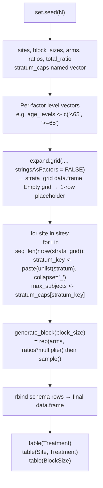

**Key R-specific details:**

- `stringsAsFactors = FALSE` is mandatory in `expand.grid()`. Without it, factor
  columns emit integer level codes instead of label strings, breaking the named-vector
  cap lookup.
- `seq_len(nrow(strata_grid))` is used instead of `1:nrow()` to avoid the `1:0 →
  c(1,0)` gotcha when there are no strata rows.
- `unlist(stratum)` coerces the single-row data.frame to a plain character vector
  before `paste()`.
- `if (is.null(schema) || nrow(schema) == 0)` guard creates an empty typed
  data.frame when all caps are zero (e.g. a new user who hasn't set caps yet).

### 11.6 Python script (`generatePython`)

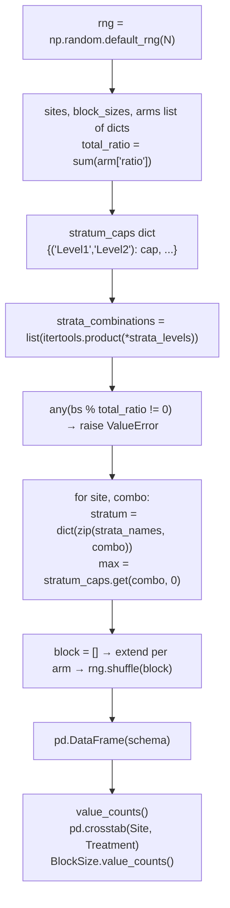

**Key Python-specific details:**

- Arms are emitted as a list of dicts: `[{"name": "Active", "ratio": 1}, ...]`. This
  keeps the data structured and avoids parallel-array synchronisation errors.
- The stratum caps dict uses a **tuple** key `(level1, level2, ...)` matching the
  `itertools.product` output exactly — no string join/split needed.
- `np.random.default_rng(N)` uses PCG64, NumPy's modern default generator, which is
  statistically superior to the legacy `np.random.seed()` / `np.random.shuffle()`
  interface.

### 11.7 SAS script (`generateSas`)

The SAS generator is the most complex because SAS uses a macro + DATA step paradigm
rather than a procedural loop.

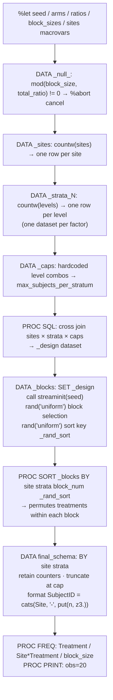

**Key SAS-specific details:**

- **Block permutation via sort:** SAS has no built-in in-memory array shuffle inside a
  DATA step. Instead, a uniform random sort key (`_rand_sort = rand('uniform')`) is
  assigned to each treatment slot in the block, then `PROC SORT` on that key achieves
  the Fisher-Yates equivalent.
- **Macro variables for parameters:** All configuration values are stored as `%let`
  macro variables so they can be referenced consistently across multiple steps
  (`&arms.`, `&seed.`, etc.).
- **`dequote()` for string parsing:** Site and arm names are passed as quoted
  space-delimited macro variable strings; `dequote(scan(...))` safely strips the
  surrounding quotes when iterating.
- **`call streaminit(seed)` is step-scoped:** The seed must be set once at the top of
  the DATA _blocks step. Calling it in a loop would reset the PRNG on every iteration,
  destroying reproducibility.
- **`_caps` LEFT JOIN:** The design matrix is built with a SQL cross join of sites,
  all strata datasets, and the caps dataset, so every combination has its enrollment
  limit attached before the generation loop runs.
- **`retain` counters:** `_site_subj_count` and `_stratum_subj_count` are retained
  across rows; `first.Site` and `first.<last_stratum>` BY-group triggers reset them
  at the correct boundaries.

### 11.8 PRNG comparison

| | Web UI | R script | Python script | SAS script |
|---|---|---|---|---|
| **Library** | `seedrandom` (Alea) | Base R | NumPy | SAS built-in |
| **Algorithm** | Alea (Mash) | Mersenne-Twister | PCG64 | Mersenne-Twister |
| **Seed type** | Arbitrary string | 31-bit integer | 31-bit integer | 31-bit integer |
| **Seed source** | User input or random string | `hashCode(webSeed)` | `hashCode(webSeed)` | `hashCode(webSeed)` |
| **Sequence matches web?** | N/A | ❌ Different | ❌ Different | ❌ Different |
| **Balance properties match?** | N/A | ✅ Same | ✅ Same | ✅ Same |
| **Reproducible within language?** | ✅ | ✅ | ✅ | ✅ |

---

## 12. ESLint Architectural Boundaries

Boundaries are enforced at lint time using `no-restricted-imports` patterns in
`eslint.config.js`. Violations are build errors in CI.

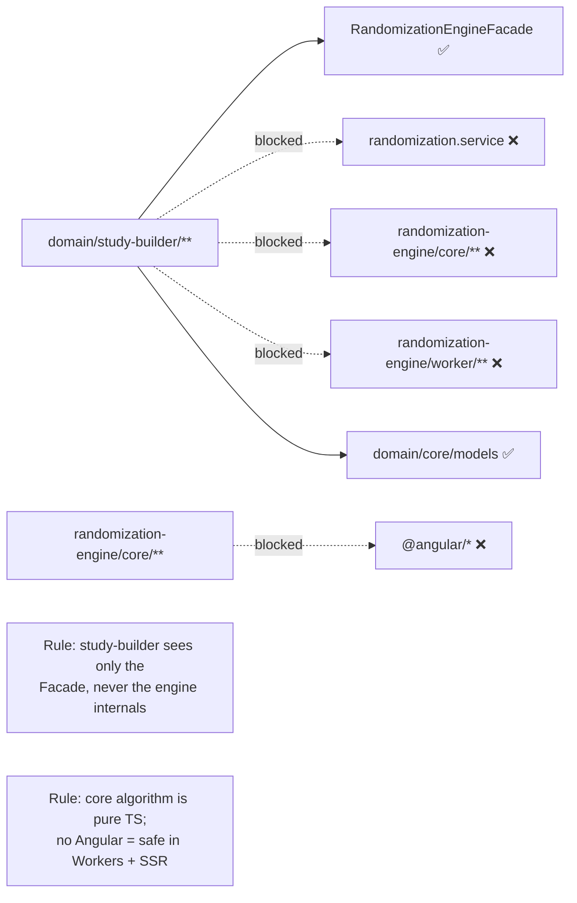

---

## 13. Testing Strategy

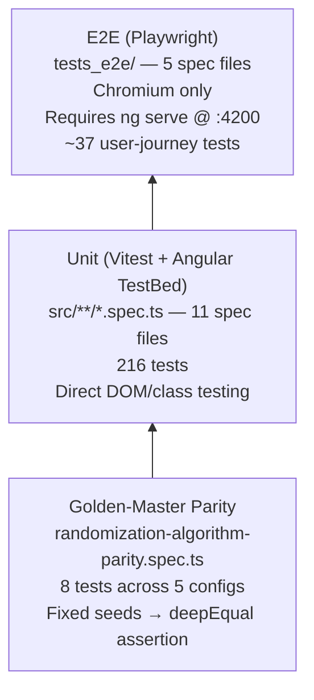

### Unit test files

| File | Tests | What it covers |
|---|---|---|
| `app.spec.ts` | 1 | App component renders without error |
| `randomization-algorithm.spec.ts` | 13 | Algorithm correctness, edge cases, throws |
| `randomization-algorithm-parity.spec.ts` | 8 | Output matches decommissioned legacy service |
| `randomization.service.spec.ts` | 7 | Observable wrapper, error paths |
| `randomization-engine.facade.spec.ts` | 22 | Worker dispatch, SSR fallback, signal updates |
| `study-builder.store.spec.ts` | 19 | SignalStore: strata, Cartesian combinations, presets, buildConfig |
| `config-form.component.spec.ts` | 29 | Reactive form init, preset loading, add/remove arms & strata, validation |
| `generator.component.spec.ts` | 15 | Error/loading/results conditional rendering |
| `results-grid.component.spec.ts` | 24 | Pagination, blinding toggle, CSV/PDF export |
| `code-generator-modal.component.spec.ts` | 11 | Tab switching, download, copy |
| `code-generator.service.spec.ts` | 67 | R/SAS/Python code content, seed hashing |

### E2E test files

| File | What it covers |
|---|---|
| `navigation.spec.ts` | Landing page, header nav, About page, logo link, 404 redirect |
| `form-validation.spec.ts` | Preset loading, disabled buttons, block-size validator, add arm/stratum |
| `schema-generation.spec.ts` | Full end-to-end: Complex preset → generate → blinding toggle |
| `results-operations.spec.ts` | Grid rendering, blinding, pagination, CSV/PDF downloads |
| `code-generator.spec.ts` | All 3 languages: tab switching, code content, file downloads |

### Running tests

```bash
# Unit tests (Vitest via Angular CLI)
npm test -- --watch=false

# E2E tests (requires dev server running first)
ng serve --port 4200 &
npx playwright test
```

---

## 14. Build, Tooling & Versioning

### Build pipeline

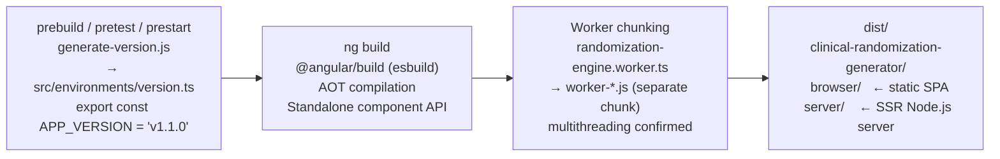

The Angular CLI uses **esbuild** (via `@angular/build`). The Web Worker is
automatically split into its own chunk (`worker-*.js`) because it is referenced via
`new URL('./worker/...', import.meta.url)` — the esbuild-specific dynamic import
form that Angular recognises as a Worker entry point.

### Vitest configuration

Vitest runs in the **jsdom** environment (configured in `vitest.config.ts`) with
Angular's `TestBed` bootstrapped in `src/setup-vitest.ts`. Mocking uses Vitest's
`vi.fn()` / `vi.spyOn()` API.

### Release process (semantic-release)

Commits on `main` following the **Conventional Commits** specification
(`feat:`, `fix:`, `chore(release):`) trigger an automated release via the
`.releaserc.json` pipeline:

```
Conventional Commit → semantic-release
  → @semantic-release/commit-analyzer   (determine bump: major/minor/patch)
  → @semantic-release/release-notes-generator
  → @semantic-release/changelog          (update CHANGELOG.md)
  → @semantic-release/npm               (bump package.json, npmPublish: false)
  → @semantic-release/git               (commit CHANGELOG + package.json)
  → @semantic-release/github            (create GitHub Release + tag)
```

The new `APP_VERSION` is then picked up at the next `ng build` via
`generate-version.js` and stamped into every CSV, PDF, and generated script
produced by the application.

### Key scripts

| Command | Description |
|---|---|
| `npm start` | `ng serve` on default port 4200 |
| `npm run dev` | `ng serve --port=3000` |
| `npm run build` | Production build |
| `npm test -- --watch=false` | Run all Vitest unit tests once |
| `ng lint` | ESLint (TS + Angular template rules + boundary rules) |
| `npx playwright test` | Run all E2E tests (server must be running) |
