# Architecture Overview — Clinical Randomization Generator

> **Version:** v1.18.0  
> **Stack:** Angular 21 · NgRx Signals · Web Workers · Vitest · Playwright · Tailwind CSS v4

---

## Table of Contents

1. [What the Application Does](#1-what-the-application-does)
2. [Repository Layout](#2-repository-layout)
3. [Domain-Driven Design Structure](#3-domain-driven-design-structure)
4. [Application Bootstrap & Routing](#4-application-bootstrap--routing)
5. [Component Tree](#5-component-tree)
6. [Randomization Engine](#6-randomization-engine)
7. [Cap Strategy Engine](#7-cap-strategy-engine)
8. [Web Worker Communication](#8-web-worker-communication)
9. [State Management](#9-state-management)
10. [Full Data-Flow: Form → Results](#10-full-data-flow-form--results)
11. [Data Model](#11-data-model)
12. [Code Generation Service](#12-code-generation-service)
    - [12.1 Why code generation exists](#121-why-code-generation-exists)
    - [12.2 Cap strategy code generation paths](#122-cap-strategy-code-generation-paths)
    - [12.3 Seed translation — hashCode](#123-seed-translation--hashcodeseed)
    - [12.4 Overall pipeline](#124-overall-pipeline)
    - [12.5 Generated script structure](#125-generated-script-structure--section-by-section)
    - [12.6 R script](#126-r-script-generater)
    - [12.7 Python script](#127-python-script-generatepython)
    - [12.8 SAS script](#128-sas-script-generatesass)
    - [12.9 PRNG comparison](#129-prng-comparison)
    - [12.10 Code generation error hierarchy](#1210-code-generation-error-hierarchy)
13. [Core Services](#13-core-services)
14. [ESLint Architectural Boundaries](#14-eslint-architectural-boundaries)
15. [Testing Strategy](#15-testing-strategy)
16. [Build, Tooling & Versioning](#16-build-tooling--versioning)

---

## 1. What the Application Does

The Clinical Randomization Generator is a browser-only Angular SPA that produces
**statistically sound, reproducible, stratified-block randomization schemas** for
clinical trials. A researcher fills in a configuration form (treatment arms, strata,
sites, block sizes, subject-ID mask, enrollment cap strategy, optional seed) and the tool:

1. Runs a seeded **Fisher-Yates shuffle** algorithm inside a **Web Worker** to keep
   the UI fully responsive.
2. Applies one of three **Cap Strategy** modes (Manual Matrix, Proportional/LRM, or
   Marginal-Only) to enforce per-stratum or per-level enrollment limits.
3. Displays the resulting schema in a virtual-scroll results grid with blinding,
   sorting, and filtering controls.
4. Exports the schema to **CSV** or **PDF**.
5. Generates equivalent **R / SAS / Python** scripts that reproduce the same
   statistical design — including cap strategy enforcement — so the trial statistician
   can run the official schema inside a validated, 21 CFR Part 11-capable system.
6. Provides a **Monte Carlo simulation** mode to verify balance properties across
   thousands of hypothetical trials.

> **Compliance notice:** The in-browser schema is marked *DRAFT*. For regulated
> studies, only the exported code scripts should be used in production.

---

## 2. Repository Layout

```
clinical-randomization-generator/
├── docs/
│   └── ARCHITECTURE.md          ← you are here
│
├── src/
│   ├── main.ts                  Bootstrap: bootstrapApplication(App, appConfig)
│   ├── index.html               Single HTML entry point; Inter font via <link>
│   ├── styles.css               Tailwind v4 @theme block + dark mode variant
│   ├── setup-vitest.ts          Vitest global setup (Angular TestBed init)
│   │
│   ├── environments/
│   │   └── version.ts           Auto-generated: export const APP_VERSION
│   │
│   └── app/
│       ├── app.ts               Root component (header nav + <router-outlet>)
│       ├── app.config.ts        ApplicationConfig: router, HttpClient
│       ├── app.routes.ts        Route table → 3 routes
│       ├── app.spec.ts          Smoke test: App component renders
│       │
│       ├── core/                Cross-cutting infrastructure
│       │   ├── components/
│       │   │   └── toast.component.ts         CDK Overlay toast display
│       │   └── services/
│       │       ├── theme.service.ts           Dark-mode toggle (class on <html>)
│       │       ├── toast.service.ts           CDK Overlay toast queue
│       │       └── viewport.service.ts        CDK BreakpointObserver → viewportSize signal
│       │
│       ├── features/            Thin, non-domain page components
│       │   ├── landing/
│       │   │   └── landing.component.ts   Hero page with "Get Started" CTA
│       │   └── about/
│       │       └── about.component.ts     Feature overview + 21 CFR notice
│       │
│       └── domain/              All business logic — Domain-Driven Design
│           │
│           ├── core/
│           │   └── models/
│           │       └── randomization.model.ts   Shared interfaces (single source of truth)
│           │
│           ├── randomization-engine/        Bounded context 1
│           │   ├── core/
│           │   │   ├── randomization-algorithm.ts          Pure function: standard + MARGINAL_ONLY paths
│           │   │   ├── randomization-algorithm.spec.ts     Unit tests (43 tests)
│           │   │   ├── randomization-algorithm-parity.spec.ts  Golden-master parity tests (8 tests)
│           │   │   ├── cap-strategy.ts                     LRM (proportional caps) + validation
│           │   │   ├── cap-strategy.spec.ts                Unit tests (15 tests)
│           │   │   ├── subject-id-engine.ts                Token-based subject ID generator
│           │   │   ├── subject-id-engine.spec.ts           Unit tests (42 tests)
│           │   │   ├── crypto-hash.ts                      SHA-256 audit hash
│           │   │   └── crypto-hash.spec.ts                 Unit tests (11 tests)
│           │   ├── components/
│           │   │   └── monte-carlo-modal.component.ts      Progress + results for MC simulation
│           │   ├── worker/
│           │   │   ├── randomization-engine.worker.ts      Web Worker entry point
│           │   │   └── worker-protocol.ts                  Typed message interfaces
│           │   ├── randomization.service.ts                SSR/fallback Observable wrapper
│           │   ├── randomization.service.spec.ts
│           │   ├── randomization-engine.facade.ts          Single UI entry point
│           │   ├── randomization-engine.facade.spec.ts
│           │   └── randomization-engine-monte-carlo.facade.spec.ts
│           │
│           ├── study-builder/               Bounded context 2
│           │   ├── store/
│           │   │   ├── study-builder.store.ts              NgRx SignalStore
│           │   │   └── study-builder.store.spec.ts
│           │   └── components/
│           │       ├── generator.component.ts              Page shell + tabs (grid / balance)
│           │       ├── generator.component.spec.ts
│           │       ├── config-form.component.ts            Reactive form + cap strategy UI
│           │       ├── config-form.component.html
│           │       ├── config-form.component.spec.ts
│           │       ├── block-preview.component.ts          Live block allocation preview
│           │       ├── block-preview.component.spec.ts
│           │       ├── tag-input.component.ts              Tag input widget
│           │       ├── tag-input.component.spec.ts
│           │       ├── skeleton-grid.component.ts          Loading skeleton placeholder
│           │       └── zero-state.component.ts             Empty-state prompt
│           │
│           └── schema-management/           Bounded context 3
│               ├── errors/
│               │   └── code-generation-errors.ts           Typed error hierarchy (6 classes)
│               ├── services/
│               │   ├── code-generator.service.ts           R / SAS / Python emitters (3 cap modes)
│               │   ├── code-generator.service.spec.ts
│               │   ├── schema-view-state.service.ts        Shared unblinding + filter state
│               │   └── schema-view-state.service.spec.ts
│               └── components/
│                   ├── results-grid.component.ts           Virtual-scroll flat + grouped views
│                   ├── results-grid.component.html
│                   ├── results-grid.component.spec.ts
│                   ├── balance-verification.component.ts   Statistical balance dashboard
│                   ├── balance-verification.component.spec.ts
│                   ├── schema-analytics-dashboard.component.ts  ECharts visualizations
│                   ├── schema-analytics-dashboard.component.spec.ts
│                   ├── schema-verification.component.ts    Audit hash + verification status
│                   ├── schema-verification.component.spec.ts
│                   ├── code-generator-modal.component.ts   Language-tab modal
│                   └── code-generator-modal.component.spec.ts

├── tests_e2e/                   Playwright end-to-end tests
│   ├── navigation.spec.ts
│   ├── form-validation.spec.ts
│   ├── schema-generation.spec.ts
│   ├── results-operations.spec.ts
│   └── code-generator.spec.ts
│
├── generate-version.js          Pre-build script: writes src/environments/version.ts
├── angular.json                 Angular CLI workspace config
├── eslint.config.js             ESLint + angular-eslint + boundary rules
├── playwright.config.ts         Playwright project config
├── tsconfig.json                TypeScript base config
├── vitest.config.ts             Vitest config (jsdom environment)
├── .releaserc.json              semantic-release config
└── package.json
```

---

## 3. Domain-Driven Design Structure

The `src/app/domain/` tree is organised around three bounded contexts that each own their code and have strict import rules enforced by ESLint.

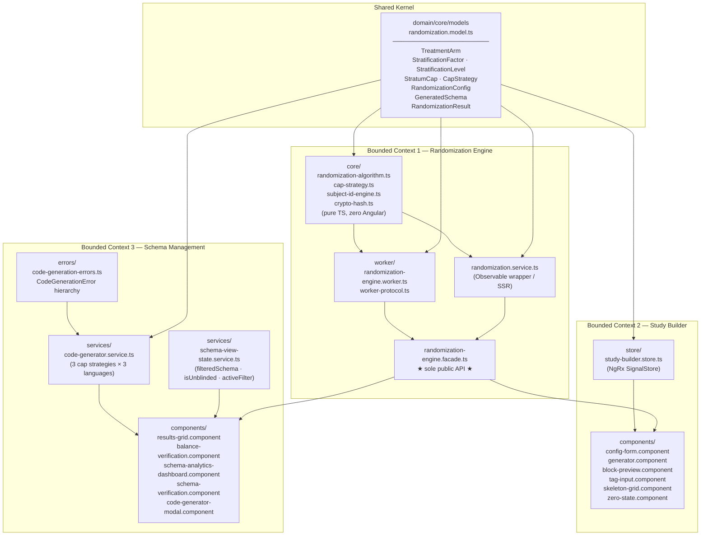

**Dependency rules (enforced by ESLint `no-restricted-imports`):**

| Consumer | Allowed | Forbidden |
|---|---|---|
| `study-builder/**` | `RandomizationEngineFacade`, `domain/core/models` | `randomization.service`, `core/**` (algorithm), `worker/**` |
| `randomization-engine/core/**` | `domain/core/models`, `seedrandom` | Any `@angular/*` package |

---

## 4. Application Bootstrap & Routing

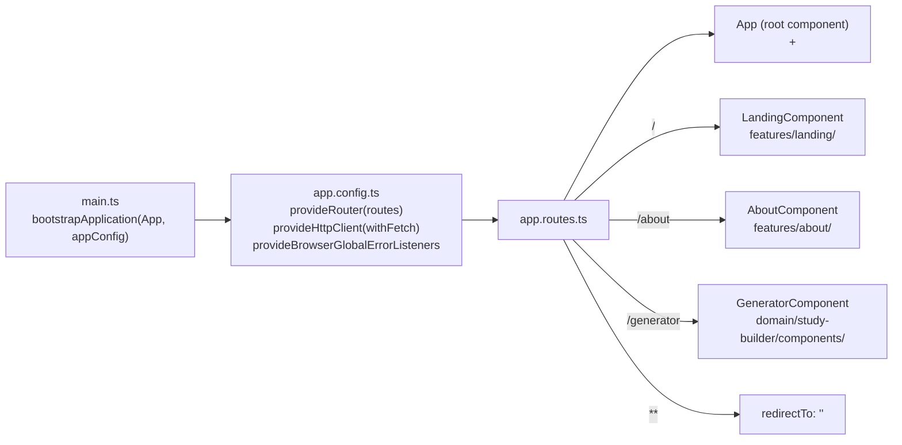

`appConfig` uses the **standalone component API** (no `NgModule`). `HttpClient` is
provided via `withFetch()` for compatibility with the Angular `@angular/ssr` SSR
adapter (the app ships an SSR server in `dist/app/server/server.mjs`).

---

## 5. Component Tree

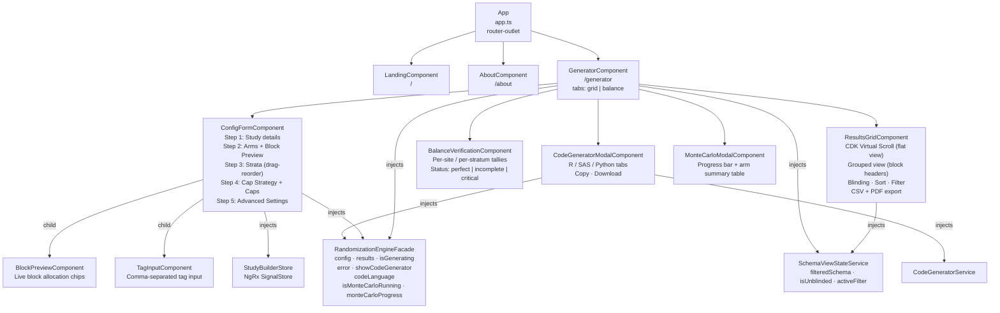

All components are **standalone** (no `NgModule`). The `RandomizationEngineFacade`
and `SchemaViewStateService` are both `providedIn: 'root'`, making them singletons
shared across components without manual provider registration.

**Key UI patterns:**
- `ConfigFormComponent` is a 5-step config wizard using a custom `WizardStepperComponent` that extends CDK Stepper.
- `ResultsGridComponent` uses **CDK Virtual Scroll** (`ScrollingModule`) for the flat view (`itemSize=48`). `processedData()` is a computed signal: filteredSchema → column filterState → sortState.
- The grouped view renders block headers + data rows + summary rows in a 600 px scrollable `div` using `@for`.
- `SchemaViewStateService` (singleton) holds `isUnblinded`, `activeFilter`, and the `filteredSchema` computed signal — both `ResultsGridComponent` and `SchemaAnalyticsDashboardComponent` inject it.
- `ToastService` uses a CDK Overlay (single bottom-right overlay) attached to a `ToastComponent` that reads from `ToastService.toasts()`.
- `ViewportService` exposes a `viewportSize()` signal (`'mobile' | 'tablet' | 'desktop'`) via CDK `BreakpointObserver`.

---

## 6. Randomization Engine

The randomization engine is split into three layers to satisfy two conflicting
requirements: **(a)** the algorithm must run inside a Web Worker (no Angular), and
**(b)** the rest of the app is Angular.

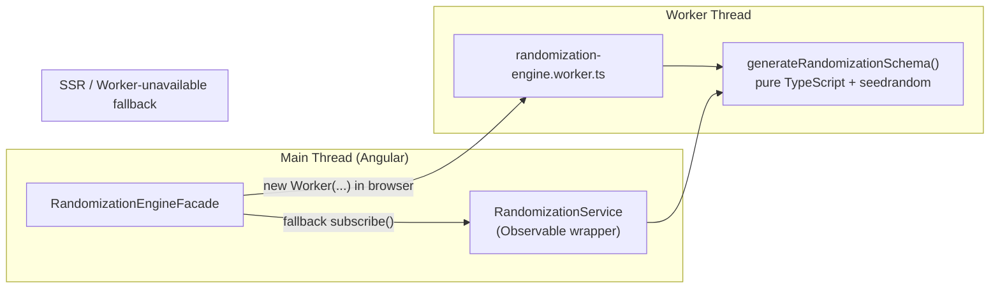

### The Core Algorithm (`randomization-algorithm.ts`)

The single exported function `generateRandomizationSchema(config)`:

1. **Resolves seed** — uses `config.seed` if provided, otherwise generates a random
   string and attaches it to a copy of the config (non-mutating).
2. **Cartesian product** — iterates `config.strata` to build every combination of
   stratum levels (e.g. `{sex: M, age: <65}`, `{sex: M, age: ≥65}`, …).
3. **Validates block sizes** — throws if any block size is not an exact multiple of
   the total arm ratio sum.
4. **Dispatches by cap strategy** — `MARGINAL_ONLY` routes to `generateMarginalOnly()`;
   both `MANUAL_MATRIX` (default) and `PROPORTIONAL` route to `generateStandard()`.
5. **`generateStandard()`** — for each _(site × stratum combo)_ pair, while
   `stratumSubjectCount < intersectionCap`, picks a random block size, fills the block
   with arms weighted by ratio, then applies a **Fisher-Yates shuffle** driven by the
   `seedrandom` PRNG.
6. **`generateMarginalOnly()`** — maintains an *active pool* of all stratum combinations.
   On each iteration, picks a random active combo, generates a block using Fisher-Yates,
   and increments per-level counts. Any combo whose level counts would breach a marginal
   cap is pruned from the active pool. Generation terminates when the pool is empty.
7. **Formats subject IDs** — calls `generateSubjectId()` from `subject-id-engine.ts`
   to expand the mask tokens into the final subject ID string.
8. Returns a `RandomizationResult` with `schema[]` rows and `metadata`.

### Termination guarantee for MARGINAL_ONLY

`generateMarginalOnly` throws if no stratification factor has a finite `marginalCap`
on **every** one of its levels. This is the weakest sufficient condition that
guarantees every possible stratum combination is eventually pruned from the active pool:
any combination that includes the fully-capped factor will be pruned when that factor's
cap is exhausted. A weaker "at least one cap anywhere" check can still produce
non-terminating loops for combinations composed entirely of uncapped levels.

### Subject ID Engine (`subject-id-engine.ts`)

Supports both modern brace-token and legacy bracket-token formats:

| Token | Replacement |
|---|---|
| `{SITE}` | Raw site identifier |
| `{STRATUM}` | Stratum code (3-char abbreviations joined with `-`) |
| `{SEQ:n}` | Site-scoped sequence number, zero-padded to `n` digits |
| `{RND:n}` | Cryptographically random `n`-digit number (collision-safe) |
| `{CHECKSUM}` | Luhn check digit of the preceding numeric digits |
| `[SiteID]` | *(legacy)* Raw site identifier |
| `[StratumCode]` | *(legacy)* Same as `{STRATUM}` |
| `[001]` / `[0001]` | *(legacy)* Sequence counter padded to 3 / 4 digits |

Cryptographic randomness uses `globalThis.crypto.getRandomValues()`. A `usedSubjectIds`
Set is passed through the engine to prevent collisions when `{RND:n}` is used.

### Audit Hash (`crypto-hash.ts`)

`computeAuditHash(result)` serialises the result metadata and schema to a canonical
JSON payload (keys sorted deterministically) then computes a SHA-256 hex digest via
the Web Crypto API. The hash is attached to `metadata.auditHash` asynchronously by
the Facade after the worker returns. It changes whenever the seed, config, or any
schema row changes, providing a tamper-evident fingerprint.

> **Parity guarantee:** The golden-master tests in
> `randomization-algorithm-parity.spec.ts` assert that `generateRandomizationSchema`
> produces the exact same field-by-field output as the decommissioned legacy
> `RandomizationService` for five diverse configurations. Any change to the PRNG
> consumption order will break these tests and must be rejected.

### Monte Carlo Simulation

The Facade exposes `runMonteCarlo(config)` which sends a `'START_MONTE_CARLO'` command
to the worker. The worker runs `N` iterations of `generateRandomizationSchema`, streams
`MONTE_CARLO_PROGRESS` updates back to the main thread at regular intervals, and
finally sends a `MONTE_CARLO_SUCCESS` payload with:
- `totalIterations`, `totalSubjectsSimulated`
- per-arm: `expectedCount`, `actualCount`, `ratio`

Results are displayed in `MonteCarloModalComponent` with a live progress bar and a
summary table.

---

## 7. Cap Strategy Engine

`cap-strategy.ts` contains the **Largest Remainder Method (LRM)** used by the
Proportional strategy and shared validation utilities.

### Three cap strategies

| Strategy | Description | Engine path |
|---|---|---|
| `MANUAL_MATRIX` | User enters a cap for each stratum intersection explicitly | `generateStandard()` |
| `PROPORTIONAL` | LRM computes intersection caps from a global cap + per-factor % weights | `generateStandard()` (LRM-computed caps) |
| `MARGINAL_ONLY` | User sets per-level limits; no intersection caps needed | `generateMarginalOnly()` (active-pool algorithm) |

### Largest Remainder Method — `computeProportionalCaps()`

Implements the **Hare–Niemeyer** algorithm:

1. Compute the theoretical (real-valued) target for each intersection:
   `probability × globalCap`, where probability is the product of each factor's level
   percentage / 100.
2. **Floor** every theoretical value.
3. **Distribute remaining seats** (`globalCap − Σfloors`) to the intersections with the
   largest fractional remainders (descending order; index as tie-break).

The sum of all output caps is guaranteed to equal `globalCap` exactly when:
- `globalCap` is a positive integer.
- Each factor's level percentages sum to exactly 100%.

`remainingSeats` is clamped to `[0, intersections]` to guard against invalid inputs.

```ts
// 60% Male × 30% Diabetic × 100 global → 18 subjects (exact)
computeProportionalCaps([gender, diabetes], 100, {
  gender:   { Male: 60, Female: 40 },
  diabetes: { Diabetic: 30, 'Non-Diabetic': 70 }
});
// → [{ levels: ['Male','Diabetic'], cap: 18 }, …]  sum = 100 ✓
```

### Percentage validation — `validateProportionalPercentages()`

Returns a `Record<factorId, true>` map of invalid factors. A factor is invalid if:
- Its level percentages do not sum to 100 (within 0.001 tolerance), **or**
- Any level's percentage is `NaN` or `±Infinity`.

NaN/Infinity inputs are detected with `Number.isFinite()` before they can propagate
into the LRM calculation.

### UI — `ConfigFormComponent`

Step 4 of the wizard presents a **segmented control** (`role="radiogroup"`) to switch
between the three strategies. Strategy-specific sections are shown conditionally:

- **Manual Matrix**: grid of per-intersection number inputs.
- **Proportional**: global cap input + per-factor percentage spinners with a live
  running total (turns red when not 100%). "Compute Matrix" is enabled only when the
  global cap is a valid positive integer and all factors sum to 100%. Editing either
  the percentages or the global cap resets `matrixComputed` to clear stale caps.
  After computation, an editable grid shows LRM-derived caps; any edit automatically
  reverts the strategy to `MANUAL_MATRIX`.
- **Marginal Only**: per-factor, per-level number inputs. Clearing a field leaves the
  level uncapped (`undefined`). The `parseMarginalCapInput()` helper converts empty
  string / NaN / negative / non-integer values to `undefined`.

`globalCap` form control validators are **conditionally enabled**: the control is
disabled (and excluded from form validity) when the strategy is not `PROPORTIONAL`, so
a stale or missing global-cap value cannot block schema generation in other modes.
`buildFormValue()` uses `form.getRawValue()` (which includes disabled controls) to
ensure the global cap is always propagated to `buildConfig()`.

---

## 8. Web Worker Communication

The Facade owns the Worker lifecycle and uses a **promise-map pattern** to correlate
async responses to their originating calls.

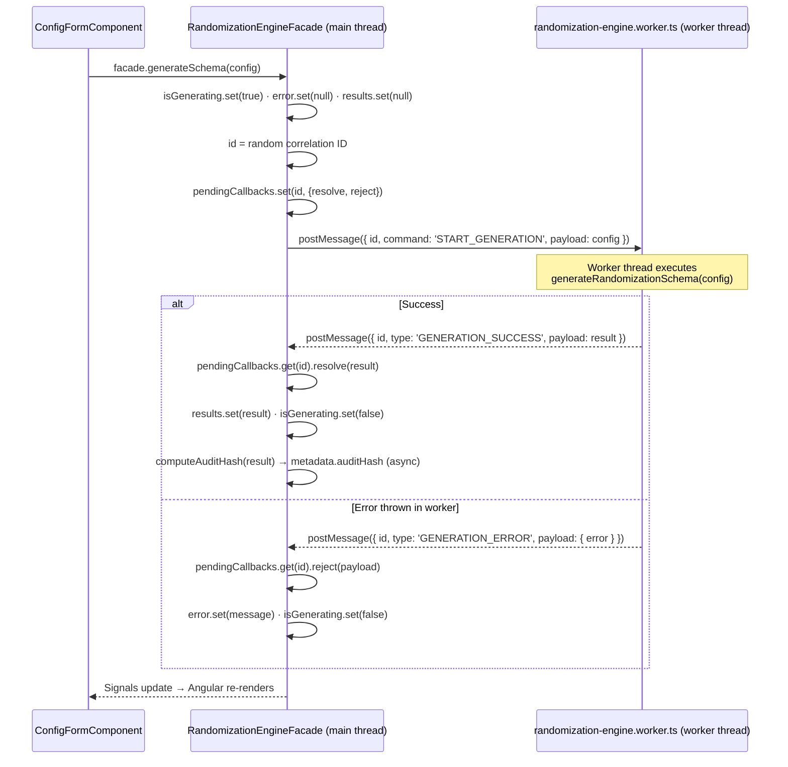

**SSR / Worker-unavailable fallback:** When `PLATFORM_ID` is not `'browser'` (SSR)
or when `new Worker(...)` throws, the Facade calls
`RandomizationService.generateSchema(config).subscribe(...)` synchronously on the
main thread. This keeps the app functional in environments that block worker
construction.

### Worker Protocol Types (`worker-protocol.ts`)

```
WorkerCommand<T>  { id: string; command: WorkerCommandType; payload: T }
WorkerResponse<T> { id: string; type: WorkerResponseType;  payload: T }

WorkerCommandType  = 'START_GENERATION' | 'START_MONTE_CARLO'
WorkerResponseType = 'GENERATION_SUCCESS' | 'GENERATION_ERROR'
                   | 'MONTE_CARLO_PROGRESS' | 'MONTE_CARLO_SUCCESS'

GenerationCommand           = WorkerCommand<RandomizationConfig>
GenerationSuccessResponse   = WorkerResponse<RandomizationResult>
GenerationErrorResponse     = WorkerResponse<{ error: { error: string } }>
MonteCarloCommand           = WorkerCommand<RandomizationConfig>
MonteCarloProgressResponse  = WorkerResponse<MonteCarloProgressPayload>
MonteCarloSuccessResponse   = WorkerResponse<MonteCarloSuccessPayload>
```

---

## 9. State Management

All mutable state that crosses the boundary between the form and the results grid
lives in three places:

| Store/Service | Location | Responsibility |
|---|---|---|
| `StudyBuilderStore` | `domain/study-builder/store/` | Strata signal → reactive Cartesian combinations; preset definitions; `buildConfig()` helper |
| `RandomizationEngineFacade` | `domain/randomization-engine/` | `config`, `results`, `isGenerating`, `error`, `showCodeGenerator`, `codeLanguage`, Monte Carlo state |
| `SchemaViewStateService` | `domain/schema-management/services/` | `isUnblinded`, `activeFilter`, `filteredSchema` (computed projection) |

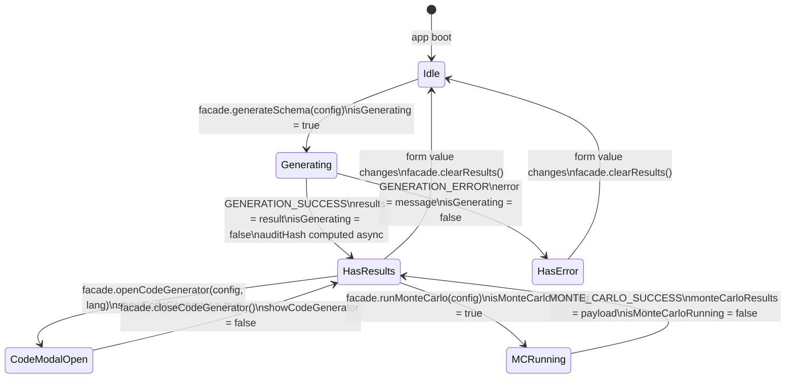

### `StudyBuilderStore` internals

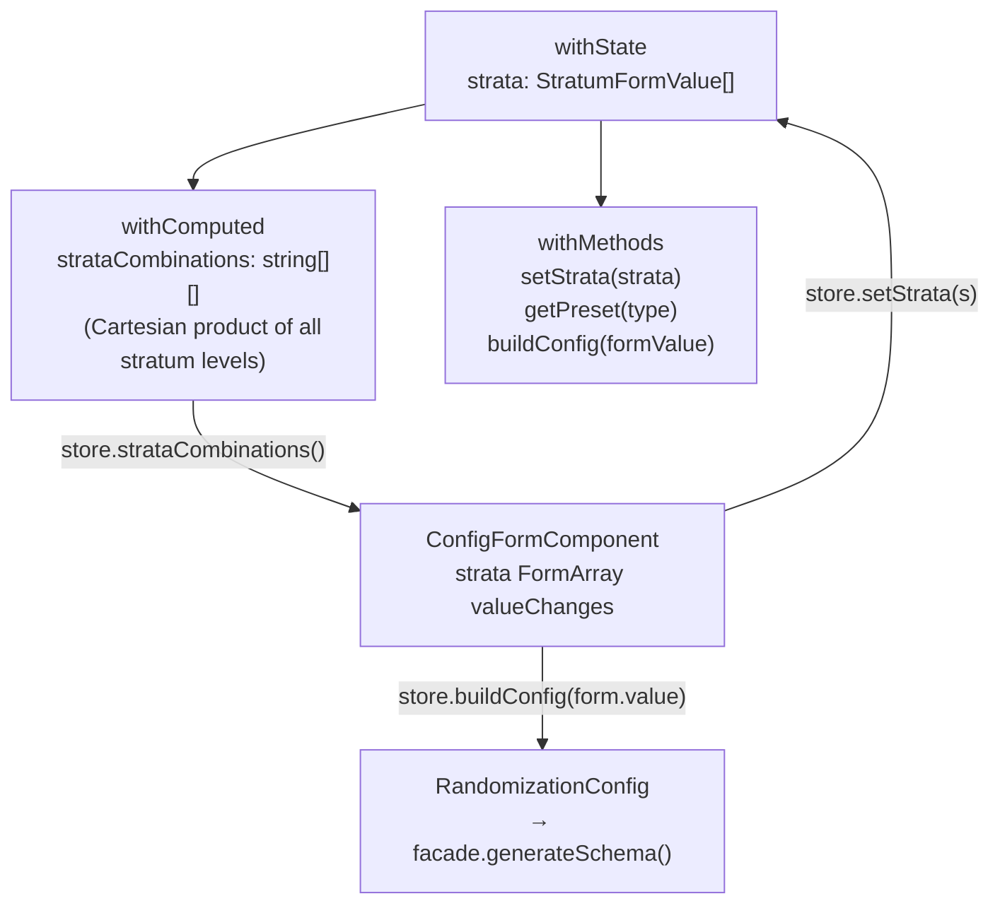

The `strataCombinations` computed signal replaces the imperative
`updateStratumCaps()` call that previously lived inside the component; Angular
re-evaluates it automatically whenever the `strata` signal changes.

### `SchemaViewStateService` internals

`SchemaViewStateService` (singleton) holds three pieces of state shared between
`ResultsGridComponent`, `SchemaAnalyticsDashboardComponent`, and `GeneratorComponent`:

- `isUnblinded: WritableSignal<boolean>` — when true, treatment arms are shown in plain text.
- `activeFilter: WritableSignal<ActiveFilter | null>` — chart-click cross-filter (`{ type: 'site' | 'treatment', value: string }`).
- `filteredSchema: Signal<GeneratedSchema[]>` — computed projection of the master schema through `activeFilter`.

`syncResults(result)` sets the raw result and clears any active filter.

---

## 10. Full Data-Flow: Form → Results

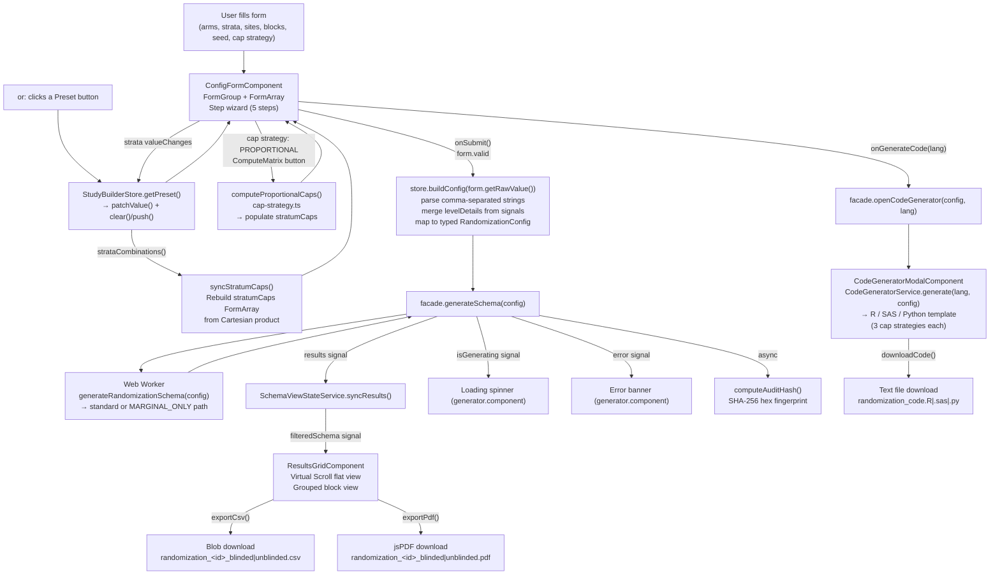

---

## 11. Data Model

All interfaces live in a single file: `domain/core/models/randomization.model.ts`.
This is the **shared kernel** — every other module imports from here; nothing
re-declares these types.

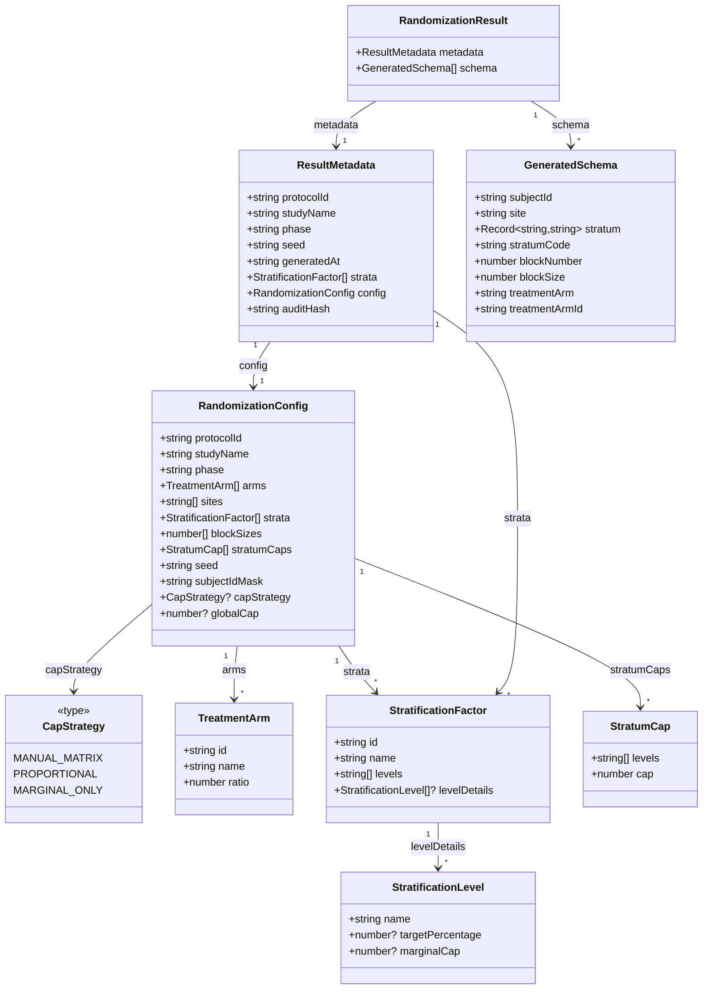

`StratificationLevel.targetPercentage` is used by `PROPORTIONAL` strategy;
`StratificationLevel.marginalCap` is used by `MARGINAL_ONLY`. Both are optional
(`undefined` means no value / uncapped). `capStrategy` defaults to `'MANUAL_MATRIX'`
when absent.

---

## 12. Code Generation Service

`CodeGeneratorService` (`domain/schema-management/services/`) is the only part of
the application that translates a `RandomizationConfig` object into runnable source
code. It is a pure, stateless service: given the same config, it always produces the
same script text.

### 12.1 Why code generation exists

The web app's PRNG is `seedrandom` (the Alea algorithm). R, SAS, and Python each
ship their own incompatible PRNGs (Mersenne-Twister, Mersenne-Twister, PCG64
respectively). A byte-identical reproduction of the web UI schema inside a validated
statistical environment is therefore impossible without shipping the Alea PRNG to
every language — impractical and unsupported.

Instead, the generated scripts embed **all study parameters as literals** and use the
language-native PRNG. The resulting schema is statistically identical in distribution
(same block sizes, same ratios, same caps, same balance properties) but the
subject-by-subject sequence differs. This is the intended workflow:

1. **Design phase** — use the web UI to quickly iterate and validate the study design.
2. **Execution phase** — download and run the generated script inside your
   organisation's validated environment to produce the **official** schema.

The exported script becomes the auditable source of truth for the trial.

### 12.2 Cap strategy code generation paths

Code generation now handles all three cap strategies for all three languages. A
private `validateMarginalOnlyConfig()` guard is called before each MARGINAL_ONLY
template is emitted. It verifies that at least one stratification factor has a finite
`marginalCap` on **every** one of its levels (using a name-keyed Map, not index lookup,
so sparse/out-of-order `levelDetails` arrays are handled safely). If the guard fails,
a `ConfigurationValidationError` is thrown before any code is emitted.

| Strategy | Template |
|---|---|
| `MANUAL_MATRIX` | Intersection-cap loop (unchanged). Header comment: `Cap Strategy: MANUAL_MATRIX`. |
| `PROPORTIONAL` | Same intersection-cap loop. Enriched header shows global cap + per-factor target percentages (looked up by level name). |
| `MARGINAL_ONLY` | Active-pool loop: `marginal_caps` declarations, per-subject level-count checks, pool pruning, `block_number` increment, QC output. |

### 12.3 Seed translation — `hashCode(seed)`

The web app stores seeds as arbitrary strings (e.g. `"abc123"` or a random
alphanumeric). Statistical software requires a non-negative 32-bit integer for
`set.seed()` / `call streaminit()` / `np.random.default_rng()`.

`hashCode(seed: string): number` converts the string:

```
hash = 0
for each character code c:
    hash = (hash << 5) - hash + c   // djb2-style multiply-add
    hash |= 0                        // coerce to signed 32-bit integer
return (hash >>> 0) % 2_147_483_647  // unsigned right-shift → mod into 31-bit range
```

The `>>> 0` unsigned right-shift avoids the `Math.abs(-2147483648) === 2147483648`
edge case that would exceed the 31-bit limit. The result is always in
`[0, 2_147_483_646]` — safe for all three language seed ranges.

### 12.4 Overall pipeline

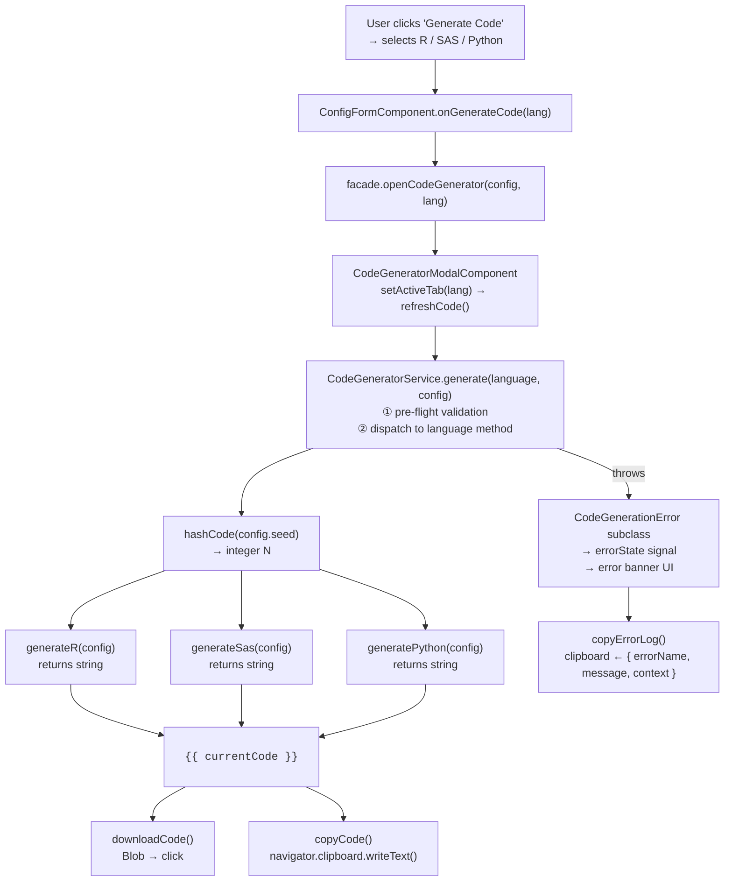

### 12.5 Generated script structure — section by section

Every generated script follows the same logical sections regardless of language:

| Section | Purpose |
|---|---|
| **File header comments** | Protocol ID, study name, app version, ISO timestamp, PRNG name, cap strategy |
| **Seed** | Language-native `set.seed()` / `call streaminit()` / `default_rng()` call |
| **Parameters** | Arms, ratios, sites, block sizes encoded as language literals |
| **Cap declarations** | MANUAL_MATRIX/PROPORTIONAL: named vector → combo key → max subjects. MARGINAL_ONLY: `marginal_caps` per-level map. |
| **Strata levels** | One variable per stratification factor listing its levels |
| **Cartesian product** | `expand.grid()` / `itertools.product()` / `proc sql cross join` |
| **Block-math failsafe** | Abort if any block size is not a multiple of total ratio |
| **Generation loop** | Sites × strata combinations (standard) or active-pool loop (marginal). Random block selection, Fisher-Yates shuffle, subject ID formatting, `BlockNumber` increment. |
| **QC tables** | Overall balance, site-level balance, block-size distribution |
| **CSV export (commented)** | `# write.csv(...)` / `# df.to_csv(...)` / `/* proc export */` |

### 12.6 R script (`generateR`)

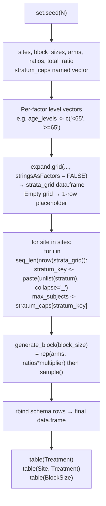

**Key R-specific details:**

- `stringsAsFactors = FALSE` is mandatory in `expand.grid()`. Without it, factor
  columns emit integer level codes instead of label strings, breaking the named-vector
  cap lookup.
- `seq_len(nrow(strata_grid))` is used instead of `1:nrow()` to avoid the `1:0 →
  c(1,0)` gotcha when there are no strata rows.
- `unlist(stratum)` coerces the single-row data.frame to a plain character vector
  before `paste()`.
- `if (is.null(schema) || nrow(schema) == 0)` guard creates an empty typed
  data.frame when all caps are zero (e.g. a new user who hasn't set caps yet).
- MARGINAL_ONLY template: `marginal_caps` named list, `active_pool` data frame,
  per-subject cap enforcement, `keep_flags` pruning, `block_number` incremented per block.

### 12.7 Python script (`generatePython`)

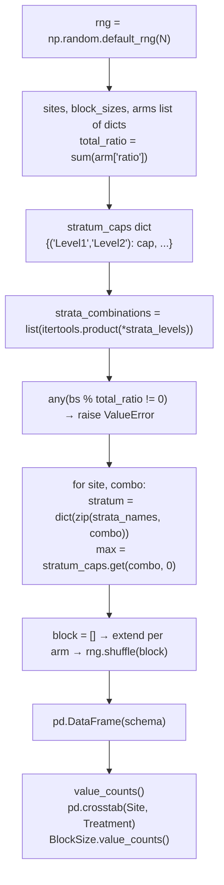

**Key Python-specific details:**

- Arms are emitted as a list of dicts: `[{"name": "Active", "ratio": 1}, ...]`. This
  keeps the data structured and avoids parallel-array synchronisation errors.
- The stratum caps dict uses a **tuple** key `(level1, level2, ...)` matching the
  `itertools.product` output exactly — no string join/split needed.
- `np.random.default_rng(N)` uses PCG64, NumPy's modern default generator, which is
  statistically superior to the legacy `np.random.seed()` / `np.random.shuffle()`
  interface.
- MARGINAL_ONLY template: `marginal_caps` dict, `active_pool` list, per-subject cap
  enforcement, pool pruning after each block, `block_number` incremented per block,
  QC cross-tabs via pandas.

### 12.8 SAS script (`generateSas`)

The SAS generator is the most complex because SAS uses a macro + DATA step paradigm
rather than a procedural loop.

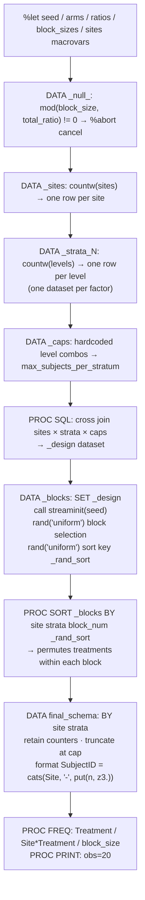

**Key SAS-specific details:**

- **Block permutation via sort:** SAS has no built-in in-memory array shuffle inside a
  DATA step. Instead, a uniform random sort key (`_rand_sort = rand('uniform')`) is
  assigned to each treatment slot in the block, then `PROC SORT` on that key achieves
  the Fisher-Yates equivalent.
- **Macro variables for parameters:** All configuration values are stored as `%let`
  macro variables so they can be referenced consistently across multiple steps
  (`&arms.`, `&seed.`, etc.).
- **`dequote()` for string parsing:** Site and arm names are passed as quoted
  space-delimited macro variable strings; `dequote(scan(...))` safely strips the
  surrounding quotes when iterating.
- **`call streaminit(seed)` is step-scoped:** The seed must be set once at the top of
  the DATA _blocks step. Calling it in a loop would reset the PRNG on every iteration,
  destroying reproducibility.
- **`_caps` LEFT JOIN:** The design matrix is built with a SQL cross join of sites,
  all strata datasets, and the caps dataset, so every combination has its enrollment
  limit attached before the generation loop runs.
- **`retain` counters:** `_site_subj_count` and `_stratum_subj_count` are retained
  across rows; `first.Site` and `first.<last_stratum>` BY-group triggers reset them
  at the correct boundaries.
- MARGINAL_ONLY template: DATA step with `_caps[]`, `_combo_fidx[]`, `_active[]`,
  and `_counts[]` temporary arrays; Fisher-Yates shuffle; DO WHILE active-pool loop;
  `_block_num = _block_num + 1` explicit increment; `BlockNumber` output field;
  QC `proc freq` steps.

### 12.9 PRNG comparison

| | Web UI | R script | Python script | SAS script |
|---|---|---|---|---|
| **Library** | `seedrandom` (Alea) | Base R | NumPy | SAS built-in |
| **Algorithm** | Alea (Mash) | Mersenne-Twister | PCG64 | Mersenne-Twister |
| **Seed type** | Arbitrary string | 31-bit integer | 31-bit integer | 31-bit integer |
| **Seed source** | User input or random string | `hashCode(webSeed)` | `hashCode(webSeed)` | `hashCode(webSeed)` |
| **Sequence matches web?** | N/A | ❌ Different | ❌ Different | ❌ Different |
| **Balance properties match?** | N/A | ✅ Same | ✅ Same | ✅ Same |
| **Reproducible within language?** | ✅ | ✅ | ✅ | ✅ |

### 12.10 Code generation error hierarchy

All code generation failures are represented by a typed class tree rooted at
`CodeGenerationError` (in `domain/schema-management/errors/code-generation-errors.ts`).
Every class carries a `context: Partial<RandomizationConfig> | null` payload so the
exact configuration that triggered the failure is always available for diagnostics.

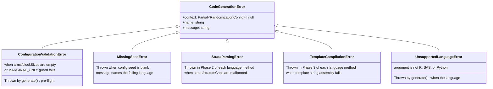

**How errors surface in the UI:**

When `CodeGeneratorService.generate()` throws, `CodeGeneratorModalComponent.refreshCode()` catches it and stores it in the `errorState` signal. The modal template replaces the code block with a structured error banner:

- Error class name (e.g. `StrataParsingError`) and full message
- Collapsible `<details>` block containing the stringified `RandomizationConfig`
- **"Copy Error Log"** button — calls `copyErrorLog()` which writes
  `{ errorName, message, context }` to the clipboard for one-click bug reports

**Isolation zones inside each language method:**

```ts
// Phase 2 — strata parsing (→ StrataParsingError)
try {
  capsVector = config.stratumCaps.map(c => ...);
  strataLevels = config.strata.map(s => ...);
} catch (e) {
  throw new StrataParsingError('R', e, config);
}

// Phase 3 — template compilation (→ TemplateCompilationError)
try {
  return `...template string...`;
} catch (e) {
  if (this.isKnownError(e)) throw e;
  throw new TemplateCompilationError('R', e, config);
}
```

The `isKnownError()` private helper ensures that a `StrataParsingError` thrown inside
Phase 2 is re-thrown as-is from Phase 3 rather than being double-wrapped.

---

## 13. Core Services

| Service | Path | Responsibility |
|---|---|---|
| `ThemeService` | `core/services/theme.service.ts` | Toggles `dark` CSS class on `<html>` element. Reads system preference on boot. |
| `ToastService` | `core/services/toast.service.ts` | CDK Overlay (single bottom-right overlay). Exposes `toasts()` signal; auto-dismisses after a configurable timeout. |
| `ViewportService` | `core/services/viewport.service.ts` | Wraps CDK `BreakpointObserver`. Exposes `viewportSize()` signal (`'mobile' \| 'tablet' \| 'desktop'`) and computed `isMobile()`, `isTablet()`, `isDesktop()` booleans. |
| `SchemaViewStateService` | `domain/schema-management/services/schema-view-state.service.ts` | Shared `isUnblinded`, `activeFilter`, `filteredSchema` signals (see §9). |

---

## 14. ESLint Architectural Boundaries

Boundaries are enforced at lint time using `no-restricted-imports` patterns in
`eslint.config.js`. Violations are build errors in CI.

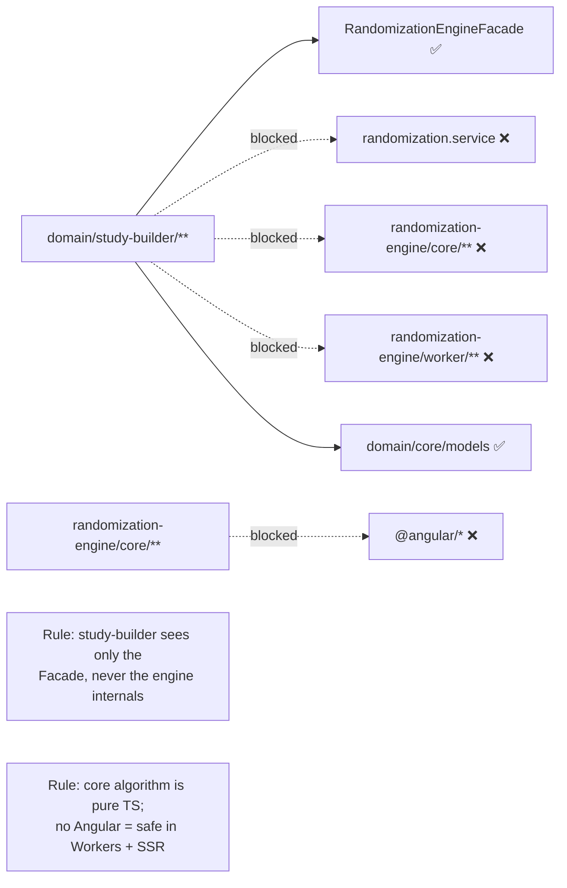

---

## 15. Testing Strategy

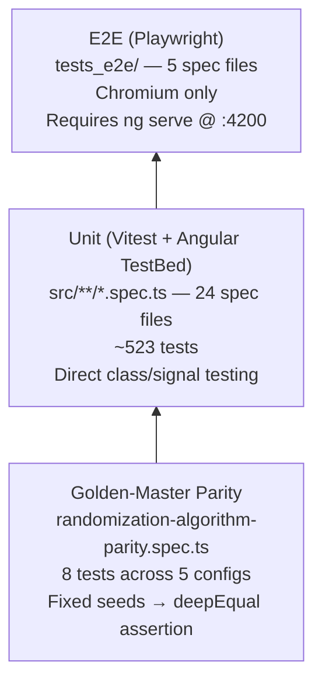

### Unit test files

| File | Tests | What it covers |
|---|---|---|
| `app.spec.ts` | 1 | App component renders without error |
| `theme.service.spec.ts` | 11 | Dark-mode toggle, system preference detection |
| `toast.service.spec.ts` | 13 | Toast queue, auto-dismiss, CDK overlay |
| `viewport.service.spec.ts` | 9 | BreakpointObserver → viewportSize signal |
| `cap-strategy.spec.ts` | 15 | LRM correctness, rounding guarantees, NaN/Infinity validation |
| `crypto-hash.spec.ts` | 11 | SHA-256 determinism, known-value test |
| `subject-id-engine.spec.ts` | 42 | All mask tokens, collision avoidance, Luhn checksum |
| `randomization-algorithm.spec.ts` | 43 | Algorithm correctness, MARGINAL_ONLY cap enforcement, throws |
| `randomization-algorithm-parity.spec.ts` | 8 | Output matches decommissioned legacy service |
| `randomization.service.spec.ts` | 7 | Observable wrapper, error paths |
| `randomization-engine.facade.spec.ts` | 22 | Worker dispatch, SSR fallback, signal updates |
| `randomization-engine-monte-carlo.facade.spec.ts` | 7 | Monte Carlo progress/success signals |
| `study-builder.store.spec.ts` | 19 | SignalStore: strata, Cartesian combinations, presets, buildConfig |
| `block-preview.component.spec.ts` | 19 | Block chip allocation, computed signals |
| `tag-input.component.spec.ts` | 22 | Tag-input keyboard/pointer, duplicate rejection |
| `config-form.component.spec.ts` | 42 | Reactive form init, preset loading, add/remove arms & strata, cap strategy, validation |
| `generator.component.spec.ts` | 23 | Error/loading/results conditional rendering, Monte Carlo |
| `schema-view-state.service.spec.ts` | 12 | filteredSchema projection, cross-filter, blinding toggle |
| `balance-verification.component.spec.ts` | 20 | Global/site/stratum aggregation, status computation |
| `schema-analytics-dashboard.component.spec.ts` | 9 | ECharts data binding |
| `schema-verification.component.spec.ts` | 23 | Audit hash display, verification status |
| `results-grid.component.spec.ts` | 36 | Virtual scroll, grouped view, blinding, CSV/PDF export |
| `code-generator-modal.component.spec.ts` | 14 | Tab switching, download, copy, error state |
| `code-generator.service.spec.ts` | 107 | All 3 cap strategies × 3 languages, seed hashing, error hierarchy, MARGINAL_ONLY guard |

### E2E test files

| File | What it covers |
|---|---|
| `navigation.spec.ts` | Landing page, header nav, About page, logo link, 404 redirect |
| `form-validation.spec.ts` | Preset loading, disabled buttons, block-size validator, add arm/stratum |
| `schema-generation.spec.ts` | Full end-to-end: Complex preset → generate → blinding toggle |
| `results-operations.spec.ts` | Grid rendering, blinding, virtual scroll, CSV/PDF downloads |
| `code-generator.spec.ts` | All 3 languages: tab switching, code content, file downloads |

### Running tests

```bash
# Unit tests (Vitest via Angular CLI)
npm test -- --watch=false

# Or directly with the vitest binary:
./node_modules/.bin/vitest run

# E2E tests (requires dev server running first)
ng serve --port 4200 &
npx playwright test
```

---

## 16. Build, Tooling & Versioning

### Build pipeline

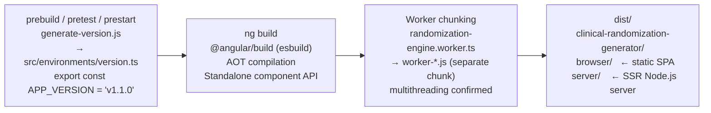

The Angular CLI uses **esbuild** (via `@angular/build`). The Web Worker is
automatically split into its own chunk (`worker-*.js`) because it is referenced via
`new URL('./worker/...', import.meta.url)` — the esbuild-specific dynamic import
form that Angular recognises as a Worker entry point.

### Vitest configuration

Vitest runs in the **jsdom** environment (configured in `vitest.config.ts`) with
Angular's `TestBed` bootstrapped in `src/setup-vitest.ts`. Mocking uses Vitest's
`vi.fn()` / `vi.spyOn()` API. The test runner binary is at
`./node_modules/.bin/vitest`.

### Release process (semantic-release)

Commits on `main` following the **Conventional Commits** specification
(`feat:`, `fix:`, `chore(release):`) trigger an automated release via the
`.releaserc.json` pipeline:

```
Conventional Commit → semantic-release
  → @semantic-release/commit-analyzer   (determine bump: major/minor/patch)
  → @semantic-release/release-notes-generator
  → @semantic-release/changelog          (update CHANGELOG.md)
  → @semantic-release/npm               (bump package.json, npmPublish: false)
  → @semantic-release/git               (commit CHANGELOG + package.json)
  → @semantic-release/github            (create GitHub Release + tag)
```

The new `APP_VERSION` is then picked up at the next `ng build` via
`generate-version.js` and stamped into every CSV, PDF, and generated script
produced by the application.

### Key scripts

| Command | Description |
|---|---|
| `npm start` | `ng serve` on default port 4200 |
| `npm run dev` | `ng serve --port=3000` |
| `npm run build` | Production build (esbuild + SSR) |
| `npm test -- --watch=false` | Run all Vitest unit tests once |
| `./node_modules/.bin/vitest run` | Run all unit tests (alternative, faster) |
| `ng lint` | ESLint (TS + Angular template rules + boundary rules) |
| `npx playwright test` | Run all E2E tests (server must be running) |
