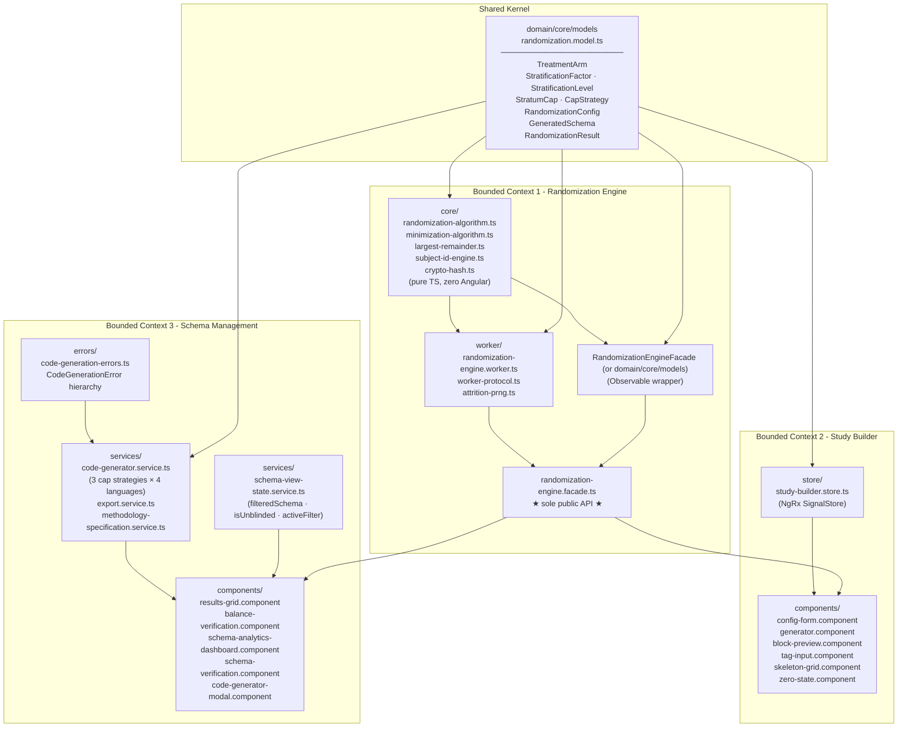
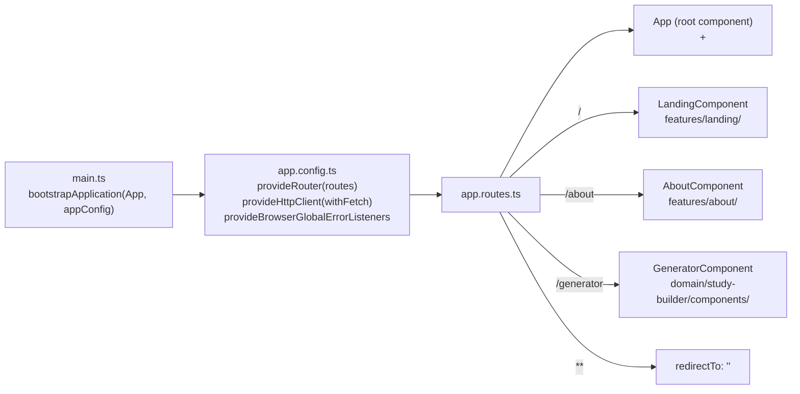
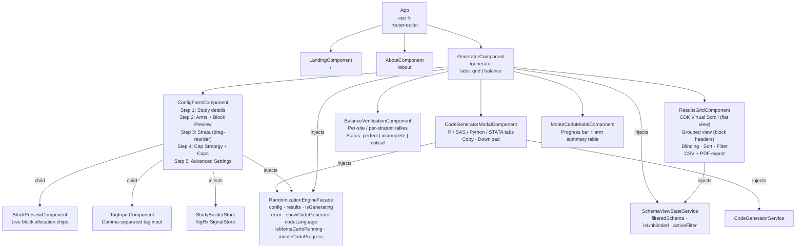
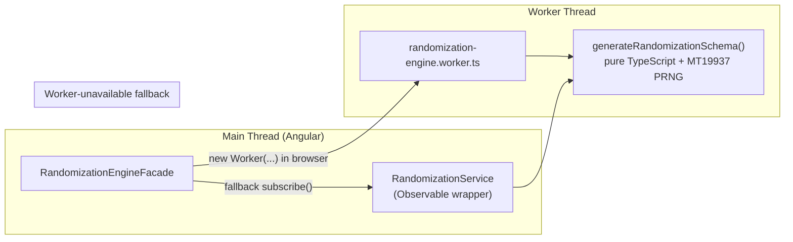
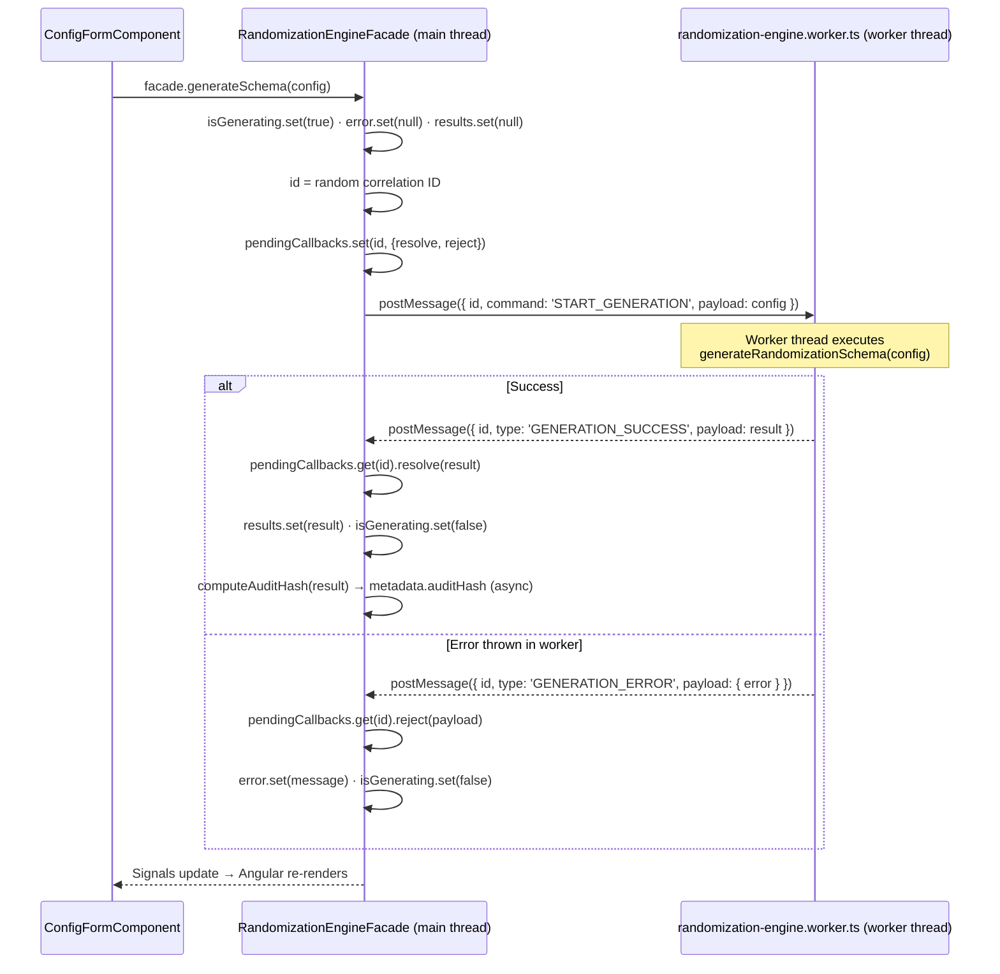
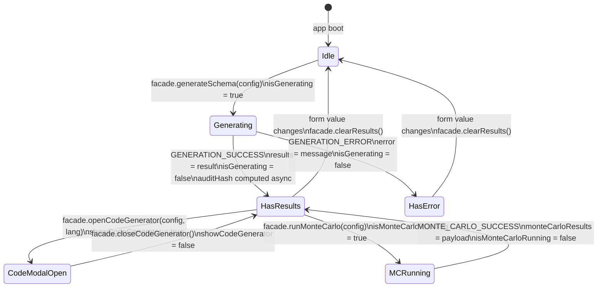
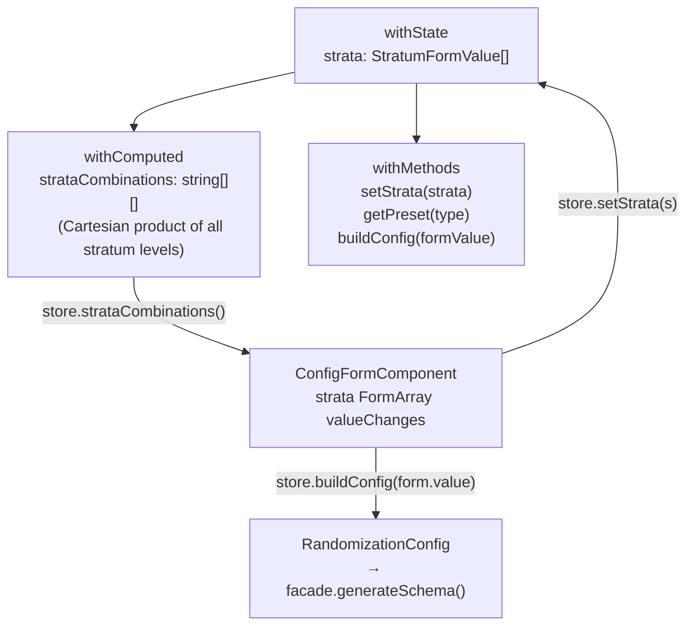
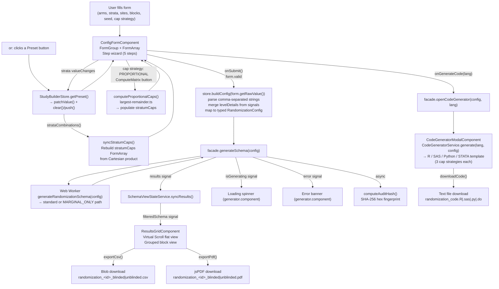
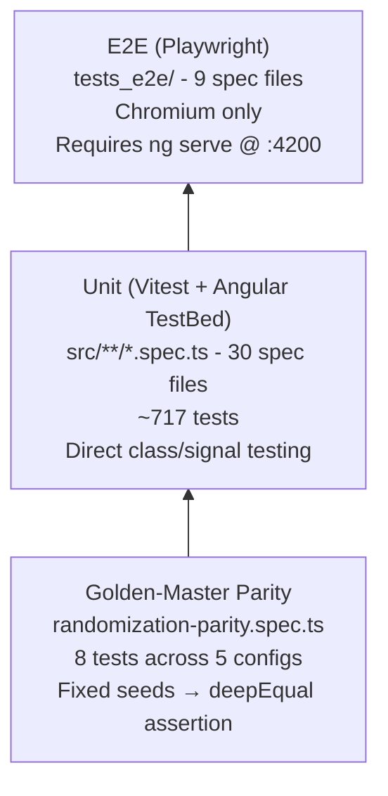

# Architecture Concepts - Equipose

> **Version:** v1.18.0  
> **Stack:** Angular 21 · NgRx Signals · Web Workers · Vitest · Playwright · Tailwind CSS v4

---

## 1. What the Application Does

The Clinical Randomization Generator is a static Single Page Application (SPA) compatible with Cloudflare Pages that produces
**statistically sound, reproducible, stratified-block and minimization (Pocock-Simon) randomization schemas** for
clinical trials. A researcher fills in a configuration form (treatment arms, strata,
sites, block sizes, subject-ID mask, enrollment cap strategy, optional seed) and the tool:

1. Runs a seeded **Fisher-Yates shuffle** or **Minimization algorithm** inside a **Web Worker** to keep
   the UI fully responsive.
2. Applies one of three **Cap Strategy** modes (Manual Matrix, Proportional/LRM, or
   Marginal-Only) to enforce per-stratum or per-level enrollment limits.
3. Displays the resulting schema in a virtual-scroll results grid with blinding,
   sorting, and filtering controls.
4. Exports the schema to **CSV** or **PDF**.
5. Generates equivalent **R / SAS / Python / STATA** scripts that reproduce the same
   statistical design - including cap strategy enforcement - so the trial statistician
   can run the official schema inside a validated, 21 CFR Part 11-capable system.
6. Provides a **Monte Carlo simulation** mode to verify balance properties across
   thousands of hypothetical trials.

> **Compliance notice:** The in-browser schema is marked *DRAFT*. For regulated
> studies, only the exported code scripts should be used in production.

---

## 3. Domain-Driven Design Structure

The `src/app/domain/` tree is organised around three bounded contexts that each own their code and have strict import rules enforced by ESLint.



**Dependency rules (enforced by ESLint `no-restricted-imports`):**

| Consumer | Allowed | Forbidden |
|---|---|---|
| `study-builder/**` | `RandomizationEngineFacade`, `domain/core/models` | `RandomizationEngineFacade`, `core/**` (algorithm), `worker/**` |
| `randomization-engine/core/**` | `domain/core/models`, `MT19937 PRNG` | Any `@angular/*` package |

---

## 4. Application Bootstrap & Routing



`appConfig` uses the **standalone component API** (no `NgModule`). `HttpClient` is
provided via `withFetch()`.

---

## 5. Component Tree



All components are **standalone** (no `NgModule`). The `RandomizationEngineFacade`
and `SchemaViewStateService` are both `providedIn: 'root'`, making them singletons
shared across components without manual provider registration.

**Key UI patterns:**
- `ConfigFormComponent` is a 5-step config wizard using a custom `WizardStepperComponent` that extends CDK Stepper.
- `ResultsGridComponent` uses **CDK Virtual Scroll** (`ScrollingModule`) for the flat view (`itemSize=48`). `processedData()` is a computed signal: filteredSchema → column filterState → sortState.
- The grouped view renders block headers + data rows + summary rows in a 600 px scrollable `div` using `@for`.
- `SchemaViewStateService` (singleton) holds `isUnblinded`, `activeFilter`, and the `filteredSchema` computed signal - both `ResultsGridComponent` and `SchemaAnalyticsDashboardComponent` inject it.
- `ToastService` uses a CDK Overlay (single bottom-right overlay) attached to a `ToastComponent` that reads from `ToastService.toasts()`.
- `ViewportService` exposes a `viewportSize()` signal (`'mobile' | 'tablet' | 'desktop'`) via CDK `BreakpointObserver`.

---

## 6. Randomization Engine

The randomization engine is split into three layers to satisfy two conflicting
requirements: **(a)** the algorithm must run inside a Web Worker (no Angular), and
**(b)** the rest of the app is Angular.



### The Core Algorithm (`randomization-algorithm.ts`)

The single exported function `generateRandomizationSchema(config)`:

1. **Resolves seed** - uses `config.seed` if provided, otherwise generates a random
   string and attaches it to a copy of the config (non-mutating).
2. **Cartesian product** - iterates `config.strata` to build every combination of
   stratum levels (e.g. `{sex: M, age: <65}`, `{sex: M, age: ≥65}`, …).
3. **Validates block sizes** - throws if any block size is not an exact multiple of
   the total arm ratio sum.
4. **Dispatches by algorithm/strategy**:
   - If `MINIMIZATION`, delegates to `generateMinimization()` (Pocock-Simon algorithm).
   - If `BLOCK` and `MARGINAL_ONLY`, delegates to `generateMarginalOnly()`.
   - If `BLOCK` and (`MANUAL_MATRIX` or `PROPORTIONAL`), delegates to `generateStandard()`.
5. **`generateStandard()`** - for each _(site × stratum combo)_ pair, while
   `stratumSubjectCount < intersectionCap`, picks a random block size, fills the block
   with arms weighted by ratio, then applies a **Fisher-Yates shuffle** driven by the
   `MT19937 PRNG` PRNG.
6. **`generateMarginalOnly()`** - maintains an *active pool* of all stratum combinations.
   On each iteration, picks a random active combo, generates a block using Fisher-Yates,
   and increments per-level counts. Any combo whose level counts would breach a marginal
   cap is pruned from the active pool. Generation terminates when the pool is empty.
7. **`generateMinimization()`** - Uses the **Pocock-Simon algorithm** to probabilistically
   assign subjects to the arm that minimises overall imbalance across all marginal
   factor counts, evaluating state sequentially subject-by-subject.
8. **Formats subject IDs** - calls `generateSubjectId()` from `subject-id-engine.ts`
   to expand the mask tokens into the final subject ID string.
9. Returns a `RandomizationResult` with `schema[]` rows and `metadata`.

### Termination guarantee for MARGINAL_ONLY

`generateMarginalOnly` throws if no stratification factor has a finite `marginalCap`
on **every** one of its levels. This is the weakest sufficient condition that
guarantees every possible stratum combination is eventually pruned from the active pool:
any combination that includes the fully-capped factor will be pruned when that factor's
cap is exhausted. A weaker "at least one cap anywhere" check can still produce
non-terminating loops for combinations composed entirely of uncapped levels.

### Subject ID Engine (`subject-id-engine.ts`)

Supports both modern brace-token and legacy bracket-token formats:

| Token | Replacement |
|---|---|
| `{SITE}` | Raw site identifier |
| `{STRATUM}` | Stratum code (3-char abbreviations joined with `-`) |
| `{SEQ:n}` | Site-scoped sequence number, zero-padded to `n` digits |
| `{RND:n}` | Cryptographically random `n`-digit number (collision-safe) |
| `{CHECKSUM}` | Luhn check digit of the preceding numeric digits |
| `[SiteID]` | *(legacy)* Raw site identifier |
| `[StratumCode]` | *(legacy)* Same as `{STRATUM}` |
| `[001]` / `[0001]` | *(legacy)* Sequence counter padded to 3 / 4 digits |

Cryptographic randomness uses `globalThis.crypto.getRandomValues()`. A `usedSubjectIds`
Set is passed through the engine to prevent collisions when `{RND:n}` is used.

### Audit Hash (`crypto-hash.ts`)

`computeAuditHash(result)` serialises the result metadata and schema to a canonical
JSON payload (keys sorted deterministically) then computes a SHA-256 hex digest via
the Web Crypto API. The hash is attached to `metadata.auditHash` asynchronously by
the Facade after the worker returns. It changes whenever the seed, config, or any
schema row changes, providing a tamper-evident fingerprint.

> **Parity guarantee:** The golden-master tests in
> [`randomization-parity.spec.ts`](../../src/app/domain/randomization-engine/randomization-parity.spec.ts) assert that `generateRandomizationSchema`
> produces the exact same field-by-field output as the decommissioned legacy
> `RandomizationService` for five diverse configurations. Any change to the PRNG
> consumption order will break these tests and must be rejected.

### Monte Carlo Simulation

The Facade exposes `runMonteCarlo(config, attritionRate)` which sends a `'START_MONTE_CARLO'` command
to the worker. The worker runs `N` iterations of `generateRandomizationSchema`, streams
`MONTE_CARLO_PROGRESS` updates back to the main thread at regular intervals, and
finally sends a `MONTE_CARLO_SUCCESS` payload with:
- `totalIterations`, `totalSubjectsSimulated`, `totalRetainedSubjects`, `attritionRate`
- per-arm: `expectedCount`, `actualCount`, `expectedRetainedCount`, `retainedCount`, `ratio`

A deterministic PRNG (from `attrition-prng.ts`, seeded by the iteration index) simulates dropout
according to the requested attrition rate so that results are perfectly reproducible.

Results are displayed in `MonteCarloModalComponent` with a live progress bar and a
summary table.

---

## 7. Cap Strategy Engine

[`largest-remainder.ts`](../../src/app/domain/shared/statistical/largest-remainder.ts) contains the **Largest Remainder Method (LRM)** used by the
Proportional strategy and shared validation utilities.

### Three cap strategies

| Strategy | Description | Engine path |
|---|---|---|
| `MANUAL_MATRIX` | User enters a cap for each stratum intersection explicitly | `generateStandard()` |
| `PROPORTIONAL` | LRM computes intersection caps from a global cap + per-factor % weights | `generateStandard()` (LRM-computed caps) |
| `MARGINAL_ONLY` | User sets per-level limits; no intersection caps needed | `generateMarginalOnly()` (active-pool algorithm) |

### Largest Remainder Method - `computeProportionalCaps()`

Implements the **Hare–Niemeyer** algorithm:

1. Compute the theoretical (real-valued) target for each intersection:
   `probability × globalCap`, where probability is the product of each factor's level
   percentage / 100.
2. **Floor** every theoretical value.
3. **Distribute remaining seats** (`globalCap − Σfloors`) to the intersections with the
   largest fractional remainders (descending order; index as tie-break).

The sum of all output caps is guaranteed to equal `globalCap` exactly when:
- `globalCap` is a positive integer.
- Each factor's level percentages sum to exactly 100%.

`remainingSeats` is clamped to `[0, intersections]` to guard against invalid inputs.

```ts
// 60% Male × 30% Diabetic × 100 global → 18 subjects (exact)
computeProportionalCaps([gender, diabetes], 100, {
  gender:   { Male: 60, Female: 40 },
  diabetes: { Diabetic: 30, 'Non-Diabetic': 70 }
});
// → [{ levels: ['Male','Diabetic'], cap: 18 }, …]  sum = 100 ✓
```

### Percentage validation - `validateProportionalPercentages()`

Returns a `Record<factorId, true>` map of invalid factors. A factor is invalid if:
- Its level percentages do not sum to 100 (within 0.001 tolerance), **or**
- Any level's percentage is `NaN` or `±Infinity`.

NaN/Infinity inputs are detected with `Number.isFinite()` before they can propagate
into the LRM calculation.

### UI - `ConfigFormComponent`

Step 4 of the wizard presents a **segmented control** (`role="radiogroup"`) to switch
between the three strategies. Strategy-specific sections are shown conditionally:

- **Manual Matrix**: grid of per-intersection number inputs.
- **Proportional**: global cap input + per-factor percentage spinners with a live
  running total (turns red when not 100%). "Compute Matrix" is enabled only when the
  global cap is a valid positive integer and all factors sum to 100%. Editing either
  the percentages or the global cap resets `matrixComputed` to clear stale caps.
  After computation, an editable grid shows LRM-derived caps; any edit automatically
  reverts the strategy to `MANUAL_MATRIX`.
- **Marginal Only**: per-factor, per-level number inputs. Clearing a field leaves the
  level uncapped (`undefined`). The `parseMarginalCapInput()` helper converts empty
  string / NaN / negative / non-integer values to `undefined`.

`globalCap` form control validators are **conditionally enabled**: the control is
disabled (and excluded from form validity) when the strategy is not `PROPORTIONAL`, so
a stale or missing global-cap value cannot block schema generation in other modes.
`buildFormValue()` uses `form.getRawValue()` (which includes disabled controls) to
ensure the global cap is always propagated to `buildConfig()`.

---

## 8. Web Worker Communication

The Facade owns the Worker lifecycle and uses a **promise-map pattern** to correlate
async responses to their originating calls.



**Worker-unavailable fallback:** When `new Worker(...)` throws, the Facade calls
`RandomizationService.generateSchema(config).subscribe(...)` synchronously on the
main thread. This keeps the app functional in environments that block worker
construction.

### Worker Protocol Types (`worker-protocol.ts`)

```
WorkerCommand<T>  { id: string; command: WorkerCommandType; payload: T }
WorkerResponse<T> { id: string; type: WorkerResponseType;  payload: T }

WorkerCommandType  = 'START_GENERATION' | 'START_MONTE_CARLO'
WorkerResponseType = 'GENERATION_SUCCESS' | 'GENERATION_ERROR'
                   | 'MONTE_CARLO_PROGRESS' | 'MONTE_CARLO_SUCCESS'

GenerationCommand           = WorkerCommand<RandomizationConfig>
GenerationSuccessResponse   = WorkerResponse<RandomizationResult>
GenerationErrorResponse     = WorkerResponse<{ error: { error: string } }>
MonteCarloCommand           = WorkerCommand<RandomizationConfig>
MonteCarloProgressResponse  = WorkerResponse<MonteCarloProgressPayload>
MonteCarloSuccessResponse   = WorkerResponse<MonteCarloSuccessPayload>
```

---

## 9. State Management

All mutable state that crosses the boundary between the form and the results grid
lives in three places:

| Store/Service | Location | Responsibility |
|---|---|---|
| `StudyBuilderStore` | `domain/study-builder/store/` | Strata signal → reactive Cartesian combinations; preset definitions; `buildConfig()` helper |
| `RandomizationEngineFacade` | `domain/randomization-engine/` | `config`, `results`, `isGenerating`, `error`, `showCodeGenerator`, `codeLanguage`, Monte Carlo state |
| `SchemaViewStateService` | `domain/schema-management/services/` | `isUnblinded`, `activeFilter`, `filteredSchema` (computed projection) |



### `StudyBuilderStore` internals



The `strataCombinations` computed signal replaces the imperative
`updateStratumCaps()` call that previously lived inside the component; Angular
re-evaluates it automatically whenever the `strata` signal changes.

### `SchemaViewStateService` internals

`SchemaViewStateService` (singleton) holds three pieces of state shared between
`ResultsGridComponent`, `SchemaAnalyticsDashboardComponent`, and `GeneratorComponent`:

- `isUnblinded: WritableSignal<boolean>` - when true, treatment arms are shown in plain text.
- `activeFilter: WritableSignal<ActiveFilter | null>` - chart-click cross-filter (`{ type: 'site' | 'treatment', value: string }`).
- `filteredSchema: Signal<GeneratedSchema[]>` - computed projection of the master schema through `activeFilter`.

`syncResults(result)` sets the raw result and clears any active filter.

---

## 10. Full Data-Flow: Form → Results



---

## 15. Testing Strategy



### Unit test files

| File | Tests | What it covers |
|---|---|---|
| `app.spec.ts` | 1 | App component renders without error |
| `theme.service.spec.ts` | 11 | Dark-mode toggle, system preference detection |
| `toast.service.spec.ts` | 13 | Toast queue, auto-dismiss, CDK overlay |
| `viewport.service.spec.ts` | 9 | BreakpointObserver → viewportSize signal |
| [`largest-remainder.spec.ts`](../../src/app/domain/shared/statistical/largest-remainder.spec.ts) | 15 | LRM correctness, rounding guarantees, NaN/Infinity validation |
| `crypto-hash.spec.ts` | 11 | SHA-256 determinism, known-value test |
| `subject-id-engine.spec.ts` | 42 | All mask tokens, collision avoidance, Luhn checksum |
| `minimization-algorithm.spec.ts` | 14 | Pocock-Simon minimization execution |
| `randomization-algorithm.spec.ts` | 52 | Algorithm correctness, MARGINAL_ONLY cap enforcement, minimization, throws |
| [`randomization-parity.spec.ts`](../../src/app/domain/randomization-engine/randomization-parity.spec.ts) | 8 | Output matches decommissioned legacy service |
| `statistical-validation.spec.ts` | 17 | Validation checks |
| `attrition-prng.spec.ts` | 6 | PRNG for Monte Carlo attrition |
| `randomization-engine-facade.spec.ts` | 7 | Observable wrapper, error paths |
| `randomization-engine.facade.spec.ts` | 22 | Worker dispatch, fallback, signal updates |
| `randomization-engine-monte-carlo.facade.spec.ts` | 9 | Monte Carlo progress/success signals |
| `study-builder.store.spec.ts` | 25 | SignalStore: strata, Cartesian combinations, presets, buildConfig |
| `block-preview.component.spec.ts` | 19 | Block chip allocation, computed signals |
| `tag-input.component.spec.ts` | 22 | Tag-input keyboard/pointer, duplicate rejection |
| `config-form.component.spec.ts` | 45 | Reactive form init, preset loading, add/remove arms & strata, cap strategy, validation |
| `generator.component.spec.ts` | 23 | Error/loading/results conditional rendering, Monte Carlo |
| [`export.service.spec.ts`](../../src/app/domain/schema-management/services/export.service.spec.ts) | 20 | Logic mapping to xlsx format |
| `methodology-specification.service.spec.ts` | 37 | Testing logic creating randomization plan narratives |
| `schema-view-state.service.spec.ts` | 12 | filteredSchema projection, cross-filter, blinding toggle |
| `balance-verification.component.spec.ts` | 20 | Global/site/stratum aggregation, status computation |
| `schema-analytics-dashboard.component.spec.ts` | 9 | ECharts data binding |
| `schema-verification.component.spec.ts` | 23 | Audit hash display, verification status |
| `results-grid.component.spec.ts` | 42 | Virtual scroll, grouped view, blinding, CSV/PDF export |
| `code-generator-modal.component.spec.ts` | 15 | Tab switching, download, copy, error state |
| [`code-generator.service.spec.ts`](../../src/app/domain/schema-management/services/code-generator.service.spec.ts) | 160 | All 3 cap strategies × 4 languages, seed hashing, error hierarchy, MARGINAL_ONLY guard |

### E2E test files

| File | What it covers |
|---|---|
| `a11y.spec.ts` | Checks accessibility violations across all application screens using axe-core |
| `audit-trail.spec.ts` | Validates deterministic PRNG reproducibility, verifying that identically seeded runs produce the same assignments |
| `code-generator.spec.ts` | All languages: tab switching, code content, file downloads |
| `form-validation.spec.ts` | Preset loading, disabled buttons, block-size validator, add arm/stratum |
| `monte-carlo.spec.ts` | Validates simulation modal rendering, progress updates, and attrition-adjusted outcomes |
| `navigation.spec.ts` | Landing page, header nav, About page, logo link, 404 redirect |
| `results-operations.spec.ts` | Grid rendering, blinding, virtual scroll, CSV/PDF downloads |
| `schema-generation.spec.ts` | Full end-to-end: Complex preset → generate → blinding toggle |
| `zero-trust.spec.ts` | Ensures form inputs are properly sanitized to prevent XSS and malformed config injections |

---

## 7. Persona Framework & Validation Strategy

Equipose implements a centralized programmatic authority to govern clinical data exposure, data blinding masks, and export permissions based on target user profiles. These rules are enforced entirely client-side to maintain our zero-trust, local-only architecture. For full specifications, persona permissions (Biostatistician, Trial Manager, Compliance Officer), and code-traceability details, refer to the [Persona & Validation Strategy Guide](./PERSONA_STRATEGY.md).

---

### Running tests

```bash
# Unit tests (Vitest via Angular CLI)
pnpm test -- --watch=false

# Or directly with the vitest binary:
./node_modules/.bin/vitest run

# E2E tests (requires dev server running first)
ng serve --port 4200 &
pnpm exec playwright test
```

