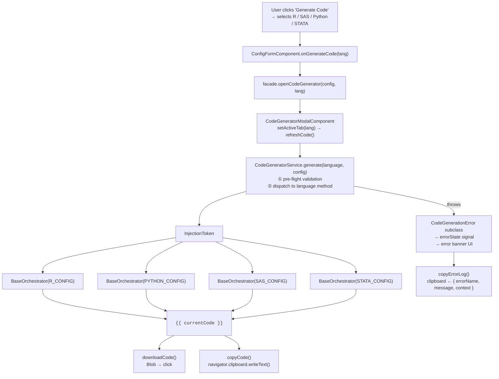
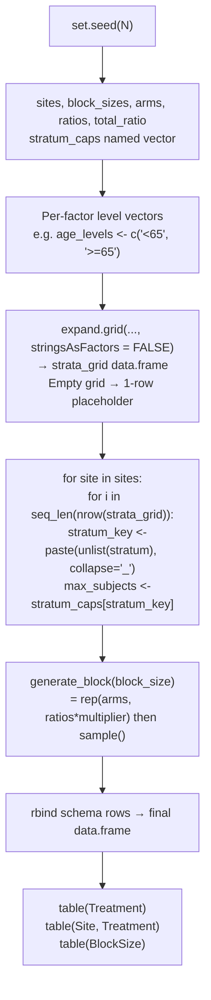
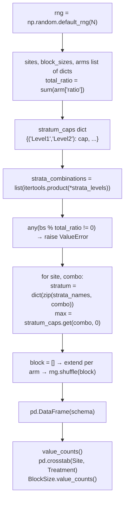
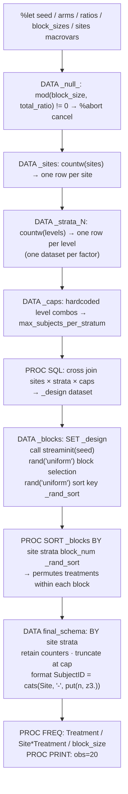
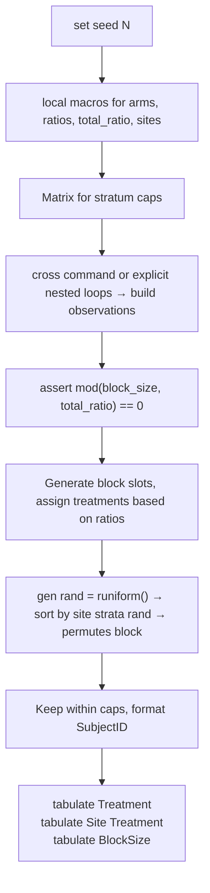
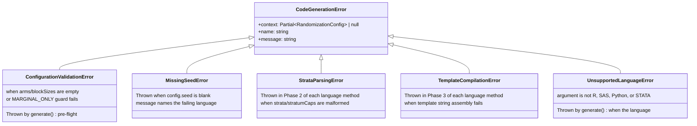
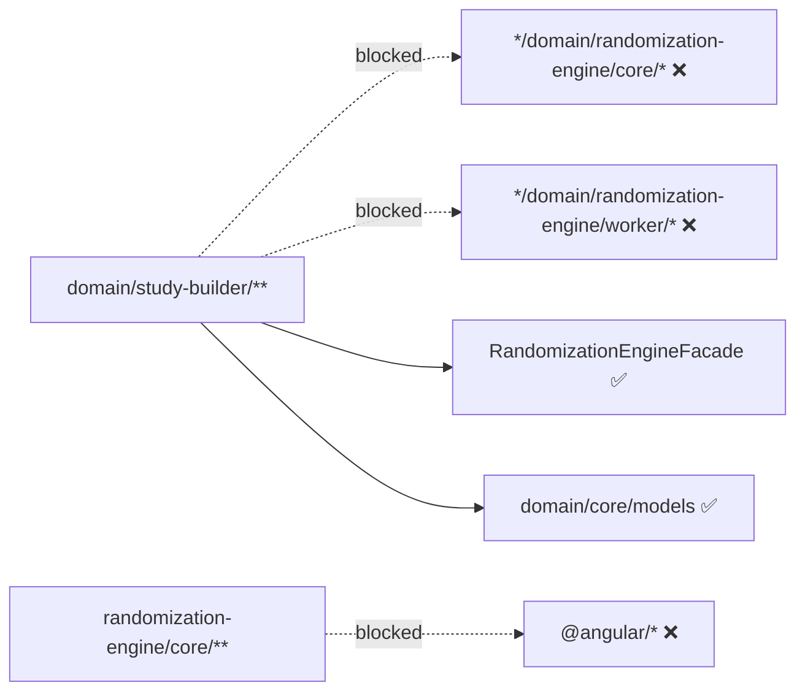
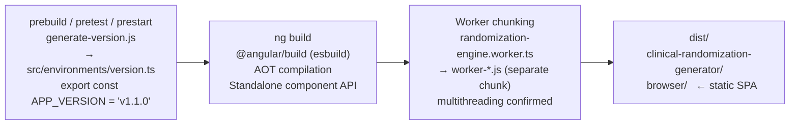

# Architecture Reference - Equipose

> **Version:** v1.18.0  
> **Stack:** Angular 21 · NgRx Signals · Web Workers · Vitest · Playwright · Tailwind CSS v4

---

## 2. Repository Layout

```
clinical-randomization-generator/
├── docs/
│   ├── explanation/ARCHITECTURE_CONCEPTS.md
│   └── reference/ARCHITECTURE_REFERENCE.md      ← you are here
│
├── src/
│   ├── main.ts                  Bootstrap: bootstrapApplication(App, appConfig)
│   ├── index.html               Single HTML entry point; Inter font via <link>
│   ├── styles.css               Tailwind v4 @theme block + dark mode variant
│   ├── setup-vitest.ts          Vitest global setup (Angular TestBed init)
│   │
│   ├── environments/
│   │   └── version.ts           Auto-generated: export const APP_VERSION
│   │
│   └── app/
│       ├── app.ts               Root component (header nav + <router-outlet>)
│       ├── app.config.ts        ApplicationConfig: router, HttpClient
│       ├── app.routes.ts        Route table → 3 routes
│       ├── app.spec.ts          Smoke test: App component renders
│       │
│       ├── core/                Cross-cutting infrastructure
│       │   ├── components/
│       │   │   ├── toast.component.ts         CDK Overlay toast display
│       │   │   └── update-banner.component.ts Update banner
│       │   └── services/
│       │       ├── seo.service.ts             SEO service
│       │       ├── theme.service.ts           Dark-mode toggle (class on <html>)
│       │       ├── toast.service.ts           CDK Overlay toast queue
│       │       ├── update-notification.service.ts Update notification
│       │       └── viewport.service.ts        CDK BreakpointObserver → viewportSize signal
│       │
│       ├── features/            Thin, non-domain page components
│       │   ├── landing/
│       │   │   └── landing.component.ts   Hero page with "Get Started" CTA
│       │   └── about/
│       │       └── about.component.ts     Feature overview + 21 CFR notice
│       │
│       └── domain/              All business logic - Domain-Driven Design
│           │
│           ├── core/
│           │   └── models/
│           │       └── randomization.model.ts   Shared  (single source of truth)
│           │
│           ├── randomization-engine/        Bounded context 1
│           │   ├── core/
│           │   │   ├── randomization-algorithm.ts          Pure function: standard + MARGINAL_ONLY paths
│           │   │   ├── randomization-algorithm.spec.ts     Unit tests
│           │   │   ├── [randomization-algorithm-golden.spec.ts](../../src/app/domain/randomization-engine/core/randomization-algorithm-golden.spec.ts)  Golden-master parity tests
│           │   │   ├── minimization-algorithm.ts           Pocock-Simon algorithm
│           │   │   ├── minimization-algorithm.spec.ts      Unit tests
│           │   │   ├── [largest-remainder.ts](../../src/app/domain/shared/statistical/largest-remainder.ts)                     LRM (proportional caps) + validation
│           │   │   ├── [largest-remainder.spec.ts](../../src/app/domain/shared/statistical/largest-remainder.spec.ts)                Unit tests
│           │   │   ├── subject-id-engine.ts                Token-based subject ID generator
│           │   │   ├── subject-id-engine.spec.ts           Unit tests
│           │   │   ├── crypto-hash.ts                      SHA-256 audit hash
│           │   │   ├── crypto-hash.spec.ts                 Unit tests
│           │   │   └── statistical-validation.spec.ts      Statistical validation tests
│           │   ├── components/
│           │   │   └── monte-carlo-modal.component.ts      Progress + results for MC simulation
│           │   ├── worker/
│           │   │   ├── randomization-engine.worker.ts      Web Worker entry point
│           │   │   ├── attrition-prng.ts                   PRNG for monte-carlo attrition
│           │   │   └── worker-protocol.ts                  Typed message 
│           │   ├── RandomizationEngineFacade (or domain/core/models)                Worker-unavailable fallback Observable wrapper
│           │   ├── randomization-engine-facade.spec.ts
│           │   ├── randomization-engine.facade.ts          Single UI entry point
│           │   ├── randomization-engine.facade.spec.ts
│           │   └── randomization-engine-monte-carlo.facade.spec.ts
│           │
│           ├── study-builder/               Bounded context 2
│           │   ├── store/
│           │   │   ├── study-builder.store.ts              NgRx SignalStore
│           │   │   └── study-builder.store.spec.ts
│           │   └── components/
│           │       ├── generator.component.ts              Page shell + tabs (grid / balance)
│           │       ├── generator.component.spec.ts
│           │       ├── config-form.component.ts            Reactive form + cap strategy UI
│           │       ├── config-form.component.html
│           │       ├── config-form.component.spec.ts
│           │       ├── block-preview.component.ts          Live block allocation preview
│           │       ├── block-preview.component.spec.ts
│           │       ├── tag-input.component.ts              Tag input widget
│           │       ├── tag-input.component.spec.ts
│           │       ├── skeleton-grid.component.ts          Loading skeleton placeholder
│           │       └── zero-state.component.ts             Empty-state prompt
│           │
│           └── schema-management/           Bounded context 3
│               ├── errors/
│               │   └── code-generation-errors.ts           Typed error hierarchy (6 classes)
│               ├── services/
│               │   ├── [code-generator.service.ts](../../src/app/domain/schema-management/services/code-generator.service.ts)           R / SAS / Python / STATA emitters (3 cap modes)
│               │   ├── [code-generator.service.spec.ts](../../src/app/domain/schema-management/services/code-generator.service.spec.ts)
│               │   ├── [export.service.ts](../../src/app/domain/schema-management/services/export.service.ts)             Excel export logic
│               │   ├── methodology-specification.service.ts Randomization Plan narrative
│               │   ├── schema-view-state.service.ts        Shared unblinding + filter state
│               │   └── schema-view-state.service.spec.ts
│               └── components/
│                   ├── results-grid.component.ts           Virtual-scroll flat + grouped views
│                   ├── results-grid.component.html
│                   ├── results-grid.component.spec.ts
│                   ├── balance-verification.component.ts   Statistical balance dashboard
│                   ├── balance-verification.component.spec.ts
│                   ├── schema-analytics-dashboard.component.ts  ECharts visualizations
│                   ├── schema-analytics-dashboard.component.spec.ts
│                   ├── schema-verification.component.ts    Audit hash + verification status
│                   ├── schema-verification.component.spec.ts
│                   ├── code-generator-modal.component.ts   Language-tab modal
│                   └── code-generator-modal.component.spec.ts

├── tests_e2e/                   Playwright end-to-end tests
│   ├── a11y.spec.ts
│   ├── audit-trail.spec.ts
│   ├── code-generator.spec.ts
│   ├── form-validation.spec.ts
│   ├── monte-carlo.spec.ts
│   ├── navigation.spec.ts
│   ├── results-operations.spec.ts
│   ├── schema-generation.spec.ts
│   └── zero-trust.spec.ts
│
├── generate-version.js          Pre-build script: writes src/environments/version.ts
├── angular.json                 Angular CLI workspace config
├── eslint.config.js             ESLint + angular-eslint + boundary rules
├── playwright.config.ts         Playwright project config
├── tsconfig.json                TypeScript base config
├── vitest.config.ts             Vitest config (jsdom environment)
├── .releaserc.json              semantic-release config
└── package.json
```

---

## 11. Data Model

All  live in a single file: `domain/core/models/randomization.model.ts`.
This is the **shared kernel** - every other module imports from here; nothing
re-declares these types.

```mermaid
classDiagram
    class TreatmentArm {
        +string id
        +string name
        +number ratio
    }

    class RandomizationMethod {
        <<type>>
        BLOCK
        MINIMIZATION
    }

    class MinimizationConfig {
        +number p
        +number totalSampleSize
    }

    class StratificationLevel {
        +string name
        +number targetPercentage?
        +number marginalCap?
        +number expectedProbability?
    }

    class StratificationFactor {
        +string id
        +string name
        +string[] levels
        +StratificationLevel[] levelDetails?
    }

    class StratumCap {
        +Record~string, string~ levelIds
        +number cap
    }

    class CapStrategy {
        <<type>>
        MANUAL_MATRIX
        PROPORTIONAL
        MARGINAL_ONLY
    }

    class BlockSelectionType {
        <<type>>
        RANDOM_POOL
        FIXED_SEQUENCE
    }

    class BlockRule {
        +BlockSelectionType selectionType
        +number[] sizes
        +Record~string, number~ limits?
    }

    class RandomizationConfig {
        +string protocolId
        +string studyName
        +string phase
        +TreatmentArm[] arms
        +string[] sites
        +StratificationFactor[] strata
        +number[] blockSizes
        +StratumCap[] stratumCaps
        +string seed
        +string subjectIdMask
        +CapStrategy capStrategy?
        +number globalCap?
        +BlockRule globalBlockStrategy?
        +Record~string, BlockRule~ siteBlockOverrides?
        +Record~string, BlockRule~ stratumBlockOverrides?
        +RandomizationMethod randomizationMethod?
        +MinimizationConfig minimizationConfig?
    }

    class GeneratedSchema {
        +string subjectId
        +string site
        +Record~string, string~ stratum
        +string stratumCode
        +number blockNumber
        +number blockSize
        +string treatmentArm
        +string treatmentArmId
    }

    class RandomizationResult {
        +{ protocolId: string; studyName: string; phase: string; seed: string; generatedAt: string; strata: StratificationFactor[]; config: RandomizationConfig; auditHash: string; } metadata
        +GeneratedSchema[] schema
    }
```

`StratificationLevel.targetPercentage` is used by `PROPORTIONAL` strategy;
`StratificationLevel.marginalCap` is used by `MARGINAL_ONLY`. Both are optional
(`undefined` means no value / uncapped). `capStrategy` defaults to `'MANUAL_MATRIX'`
when absent.

---

## 12. Code Generation Service

`CodeGeneratorService` (`domain/schema-management/services/`) is the only part of
the application that translates a `RandomizationConfig` object into runnable source
code. It is a pure, stateless service: given the same config, it always produces the
same script text.

### 12.1 Why code generation exists

The web app's PRNG is Mersenne Twister (MT19937). R, SAS, and Stata use this exact
PRNG by default, allowing a byte-identical reproduction of the web UI schema inside a validated
statistical environment natively. Python uses the MT19937 implementation natively to guarantee exactly identical bitstream output.


Instead, the generated scripts embed **all study parameters as literals** and use the
language-native PRNG. The resulting schema is statistically identical in distribution
(same block sizes, same ratios, same caps, same balance properties) but the
subject-by-subject sequence differs. This is the intended workflow:

1. **Design phase** - use the web UI to quickly iterate and validate the study design.
2. **Execution phase** - download and run the generated script inside your
   organisation's validated environment to produce the **official** schema.

The exported script becomes the auditable source of truth for the trial.

### 12.2 Cap strategy code generation paths

Code generation now handles all three cap strategies for all four languages. A
private `validateMarginalOnlyConfig()` guard is called before each MARGINAL_ONLY
template is emitted. It verifies that at least one stratification factor has a finite
`marginalCap` on **every** one of its levels (using a name-keyed Map, not index lookup,
so sparse/out-of-order `levelDetails` arrays are handled safely). If the guard fails,
a `ConfigurationValidationError` is thrown before any code is emitted.

| Strategy | Template |
|---|---|
| `MANUAL_MATRIX` | Intersection-cap loop (unchanged). Header comment: `Cap Strategy: MANUAL_MATRIX`. |
| `PROPORTIONAL` | Same intersection-cap loop. Enriched header shows global cap + per-factor target percentages (looked up by level name). |
| `MARGINAL_ONLY` | Active-pool loop: `marginal_caps` declarations, per-subject level-count checks, pool pruning, `block_number` increment, QC output. |

### 12.3 Seed translation - `hashCode(seed)`

The web app stores seeds as arbitrary strings (e.g. `"abc123"` or a random
alphanumeric). Statistical software requires a non-negative 32-bit integer for
`set.seed()` / `call streaminit()` / `np.random.default_rng()` / `set seed`.

`hashCode(seed: string): number` converts the string:

```
hash = 0
for each character code c:
    hash = (hash << 5) - hash + c   // djb2-style multiply-add
    hash |= 0                        // coerce to signed 32-bit integer
return (hash >>> 0) % 2_147_483_647  // unsigned right-shift → mod into 31-bit range
```

The `>>> 0` unsigned right-shift avoids the `Math.abs(-2147483648) === 2147483648`
edge case that would exceed the 31-bit limit. The result is always in
`[0, 2_147_483_646]` - safe for all four language seed ranges.

### 12.4 Overall pipeline



### 12.5 Generated script structure - section by section

Every generated script follows the same logical sections regardless of language:

| Section | Purpose |
|---|---|
| **File header comments** | Protocol ID, study name, app version, ISO timestamp, PRNG name, cap strategy |
| **Seed** | Language-native `set.seed()` / `call streaminit()` / `default_rng()` call |
| **Parameters** | Arms, ratios, sites, block sizes encoded as language literals |
| **Cap declarations** | MANUAL_MATRIX/PROPORTIONAL: named vector → combo key → max subjects. MARGINAL_ONLY: `marginal_caps` per-level map. |
| **Strata levels** | One variable per stratification factor listing its levels |
| **Cartesian product** | `expand.grid()` / `itertools.product()` / `proc sql cross join` |
| **Block-math failsafe** | Abort if any block size is not a multiple of total ratio |
| **Generation loop** | Sites × strata combinations (standard) or active-pool loop (marginal). Random block selection, Fisher-Yates shuffle, subject ID formatting, `BlockNumber` increment. |
| **QC tables** | Overall balance, site-level balance, block-size distribution |
| CSV export (commented) | `# write.csv(...)` / `# df.to_csv(...)` / `/* proc export */` / `* export delimited` |

### 12.6 R script (`generateR`)



**Key R-specific details:**

- `stringsAsFactors = FALSE` is mandatory in `expand.grid()`. Without it, factor
  columns emit integer level codes instead of label strings, breaking the named-vector
  cap lookup.
- `seq_len(nrow(strata_grid))` is used instead of `1:nrow()` to avoid the `1:0 →
  c(1,0)` gotcha when there are no strata rows.
- `unlist(stratum)` coerces the single-row data.frame to a plain character vector
  before `paste()`.
- `if (is.null(schema) || nrow(schema) == 0)` guard creates an empty typed
  data.frame when all caps are zero (e.g. a new user who hasn't set caps yet).
- MARGINAL_ONLY template: `marginal_caps` named list, `active_pool` data frame,
  per-subject cap enforcement, `keep_flags` pruning, `block_number` incremented per block.

### 12.7 Python script (`generatePython`)



**Key Python-specific details:**

- Arms are emitted as a list of dicts: `[{"name": "Active", "ratio": 1}, ...]`. This
  keeps the data structured and avoids parallel-array synchronisation errors.
- The stratum caps dict uses a **tuple** key `(level1, level2, ...)` matching the
  `itertools.product` output exactly - no string join/split needed.
- `np.random.MT19937` is used with `np.random.Generator` to bypass NumPy's modern defaults, ensuring
  strict reproducibility across platforms
  
- MARGINAL_ONLY template: `marginal_caps` dict, `active_pool` list, per-subject cap
  enforcement, pool pruning after each block, `block_number` incremented per block,
  QC cross-tabs via pandas.

### 12.8 SAS script (`generateSas`)

The SAS generator is the most complex because SAS uses a macro + DATA step paradigm
rather than a procedural loop.



**Key SAS-specific details:**

- **Block permutation via sort:** SAS has no built-in in-memory array shuffle inside a
  DATA step. Instead, a uniform random sort key (`_rand_sort = rand('uniform')`) is
  assigned to each treatment slot in the block, then `PROC SORT` on that key achieves
  the Fisher-Yates equivalent.
- **Macro variables for parameters:** All configuration values are stored as `%let`
  macro variables so they can be referenced consistently across multiple steps
  (`&arms.`, `&seed.`, etc.).
- **`dequote()` for string parsing:** Site and arm names are passed as quoted
  space-delimited macro variable strings; `dequote(scan(...))` safely strips the
  surrounding quotes when iterating.
- **`call streaminit(seed)` is step-scoped:** The seed must be set once at the top of
  the DATA _blocks step. Calling it in a loop would reset the PRNG on every iteration,
  destroying reproducibility.
- **`_caps` LEFT JOIN:** The design matrix is built with a SQL cross join of sites,
  all strata datasets, and the caps dataset, so every combination has its enrollment
  limit attached before the generation loop runs.
- **`retain` counters:** `_site_subj_count` and `_stratum_subj_count` are retained
  across rows; `first.Site` and `first.<last_stratum>` BY-group triggers reset them
  at the correct boundaries.
- MARGINAL_ONLY template: DATA step with `_caps[]`, `_combo_fidx[]`, `_active[]`,
  and `_counts[]` temporary arrays; Fisher-Yates shuffle; DO WHILE active-pool loop;
  `_block_num = _block_num + 1` explicit increment; `BlockNumber` output field;
  QC `proc freq` steps.

### 12.9 STATA script (`generateStata`)



**Key STATA-specific details:**

- Uses the `postfile` architecture for row-by-row memory writing during complex loops (especially for Minimization or Marginal-Only strategies).
- Variable names are kept under 32 characters to comply with STATA limits.
- Missing values (`.`) are handled mathematically as the largest possible number in STATA, so explicit guards (`< .`) are used where necessary.
- Similar to SAS, block permutation relies on generating uniform random numbers (`runiform()`) and using `sort` rather than an in-memory array shuffle.

### 12.10 PRNG comparison

| | Web UI | R script | Python script | SAS script | STATA script |
|---|---|---|---|---|---|
| **Library** | Custom MT19937 | Custom MT19937 | NumPy | Custom MT19937 | Custom MT19937 (Mata) |
| **Algorithm** | Mersenne Twister (MT19937) | Mersenne Twister (MT19937) | Mersenne Twister (MT19937) | Mersenne Twister (MT19937) | Mersenne Twister (MT19937) |
| **Seed type** | Arbitrary string | 31-bit integer | 31-bit integer | 31-bit integer | 31-bit integer |
| **Seed source** | User input or random string | `hashCode(webSeed)` | `hashCode(webSeed)` | `hashCode(webSeed)` | `hashCode(webSeed)` |
| **Sequence matches web?** | N/A | ✅ Identical | ✅ Identical | ✅ Identical | ✅ Identical |
| **Balance properties match?** | N/A | ✅ Same | ✅ Same | ✅ Same | ✅ Same |
| **Reproducible within language?** | ✅ | ✅ | ✅ | ✅ | ✅ |

### 12.11 Code generation error hierarchy

All code generation failures are represented by a typed class tree rooted at
`CodeGenerationError` (in `domain/schema-management/errors/code-generation-errors.ts`).
Every class carries a `context: Partial<RandomizationConfig> | null` payload so the
exact configuration that triggered the failure is always available for diagnostics.



**How errors surface in the UI:**

When `CodeGeneratorService.generate()` throws, `CodeGeneratorModalComponent.refreshCode()` catches it and stores it in the `errorState` signal. The modal template replaces the code block with a structured error banner:

- Error class name (e.g. `StrataParsingError`) and full message
- Collapsible `<details>` block containing the stringified `RandomizationConfig`
- **"Copy Error Log"** button - calls `copyErrorLog()` which writes
  `{ errorName, message, context }` to the clipboard for one-click bug reports

**Isolation zones inside each language method:**

```ts
// Phase 2 - strata parsing (→ StrataParsingError)
try {
  capsVector = config.stratumCaps.map(c => ...);
  strataLevels = config.strata.map(s => ...);
} catch (e) {
  throw new StrataParsingError('R', e, config);
}

// Phase 3 - template compilation (→ TemplateCompilationError)
try {
  return `...template string...`;
} catch (e) {
  if (this.isKnownError(e)) throw e;
  throw new TemplateCompilationError('R', e, config);
}
```

The `isKnownError()` private helper ensures that a `StrataParsingError` thrown inside
Phase 2 is re-thrown as-is from Phase 3 rather than being double-wrapped.

---

## 13. Core Services

| Service | Path | Responsibility |
|---|---|---|
| `ThemeService` | `core/services/theme.service.ts` | Toggles `dark` CSS class on `<html>` element. Reads system preference on boot. |
| `ToastService` | `core/services/toast.service.ts` | CDK Overlay (single bottom-right overlay). Exposes `toasts()` signal; auto-dismisses after a configurable timeout. |
| `ViewportService` | `core/services/viewport.service.ts` | Wraps CDK `BreakpointObserver`. Exposes `viewportSize()` signal (`'mobile' \| 'tablet' \| 'desktop'`) and computed `isMobile()`, `isTablet()`, `isDesktop()` booleans. |
| `SeoService` | `core/services/seo.service.ts` | Sets document metadata. |
| `ExportService` | [`domain/schema-management/services/export.service.ts`](../../src/app/domain/schema-management/services/export.service.ts) | Builds xlsx blobs for downloading randomizations |
| `MethodologySpecificationService` | `domain/schema-management/services/methodology-specification.service.ts` | Generates randomization plans as narratives |
| `SchemaViewStateService` | `domain/schema-management/services/schema-view-state.service.ts` | Shared `isUnblinded`, `activeFilter`, `filteredSchema` signals (see §9). |

---

## 14. ESLint Architectural Boundaries

Boundaries are enforced at lint time using `no-restricted-imports` patterns in
`eslint.config.js`. Violations are build errors in CI.



---

## 16. Build, Tooling & Versioning

### Build pipeline



The Angular CLI uses **esbuild** (via `@angular/build`). The Web Worker is
automatically split into its own chunk (`worker-*.js`) because it is referenced via
`new URL('./worker/...', import.meta.url)` - the esbuild-specific dynamic import
form that Angular recognises as a Worker entry point.

### Vitest configuration

Vitest runs in the **jsdom** environment (configured in `vitest.config.ts`) with
Angular's `TestBed` bootstrapped in `src/setup-vitest.ts`. Mocking uses Vitest's
`vi.fn()` / `vi.spyOn()` API. The test runner binary is at
`./node_modules/.bin/vitest`.

### Release process (semantic-release)

Commits on `main` following the **Conventional Commits** specification
(`feat:`, `fix:`, `chore(release):`) trigger an automated release via the
`.releaserc.json` pipeline:

```
Conventional Commit → semantic-release
  → @semantic-release/commit-analyzer   (determine bump: major/minor/patch)
  → @semantic-release/release-notes-generator
  → @semantic-release/changelog          (update CHANGELOG.md)
  → @semantic-release/npm               (bump package.json, npmPublish: false)
  → @semantic-release/git               (commit CHANGELOG + package.json)
  → @semantic-release/github            (create GitHub Release + tag)
```

The new `APP_VERSION` is then picked up at the next `ng build` via
`generate-version.js` and stamped into every CSV, PDF, and generated script
produced by the application.

### Key scripts

| Command | Description |
|---|---|
| `pnpm start` | `ng serve` on default port 4200 |
| `pnpm run dev` | `ng serve --port=3000` |
| `pnpm run build` | Production build (esbuild) |
| `pnpm test -- --watch=false` | Run all Vitest unit tests once |
| `./node_modules/.bin/vitest run` | Run all unit tests (alternative, faster) |
| `ng lint` | ESLint (TS + Angular template rules + boundary rules) |
| `pnpm exec playwright test` | Run all E2E tests (server must be running) |

